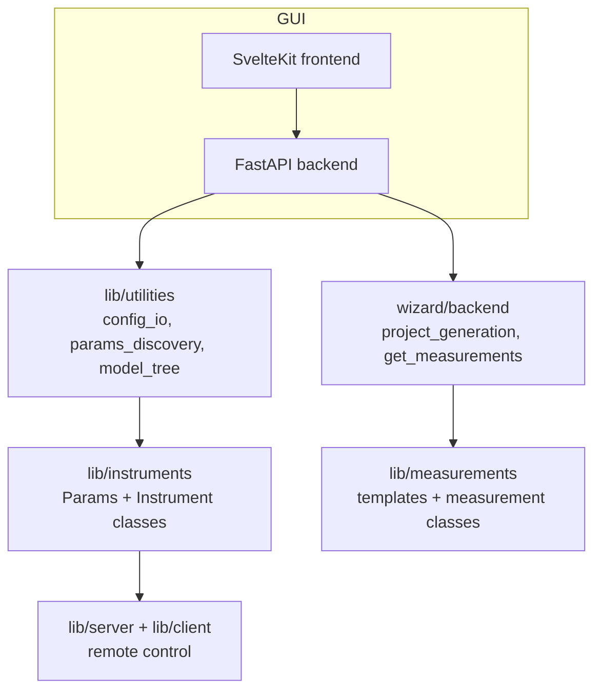
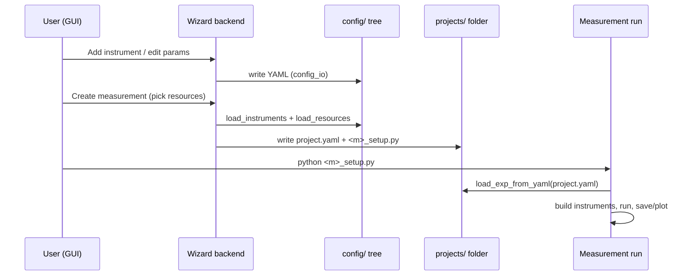

# Architecture

Lab Wizard separates cleanly into a **library** and a **GUI**, with a **config
tree** as the shared contract between them.

## The library / GUI split

- `lab_wizard/lib` is a standalone Python package. It knows nothing about the
  GUI. You can `import` it, build instruments, and run measurements with no web
  server involved. Generated measurement projects depend only on `lib`.
- `lab_wizard/wizard` is the GUI. Its backend is a FastAPI app
  ([`backend/main.py`](../../lab_wizard/wizard/backend/main.py)); its frontend is
  a pre-built SvelteKit static site served by that same app. The backend is a
  thin orchestration layer — almost every endpoint delegates to functions in
  `lib/utilities` or `wizard/backend`.

The GUI is essentially a friendly editor for the config tree plus a code
generator. Nothing the GUI does is magic — it writes YAML and generates Python
you can read.

## The four layers

1. **Instrument layer** (`lib/instruments`) — the typed model of hardware. Every
   instrument is a pair: a Pydantic **`Params`** class (serializable config) and
   an **`Instrument`** class (live, talks to hardware). See
   [Instrument model](instrument-model.md).
2. **Utilities layer** (`lib/utilities`) — loads/saves the config tree
   (`config_io`), auto-discovers instrument types from source
   (`params_discovery`), and parses project YAML into a runnable tree
   (`model_tree`). See [Config & discovery](config-and-discovery.md).
3. **Application layer** (`lib/measurements`, `lib/savers`, `lib/plotters`,
   `lib/server`, `lib/client`) — what you actually do with instruments.
4. **GUI layer** (`wizard`) — editing and code generation on top of all the above.

## Params ↔ Instrument: the central duality { #params-instrument-the-central-duality }

This pattern recurs everywhere, so internalize it early:

| | `Params` (config) | `Instrument` (runtime) |
|---|---|---|
| What it is | A Pydantic model — pure data | A live object that talks to hardware |
| Serializable? | Yes (to/from YAML) | No |
| Has a `type` discriminator? | Yes (`type: Literal["dbay"]`) | No |
| Created by | parsing YAML | `params.create_inst()` / `Parent.make_child()` |
| Knows its runtime class? | Yes, via the `inst` property | — |

A `Params` object describes *what* an instrument is and how to reach it; calling
`create_inst()` (or `from_params(params)`) produces the live `Instrument`. This
keeps configuration declarative and hardware access lazy — you can load,
inspect, and edit the entire instrument tree without opening a single serial
port.

## Data flow: from config to a running measurement

There are two ways the same instrument config reaches a running measurement:

- **Local / explicit:** the generated `*_setup.py` calls
  `load_exp_from_yaml(project.yaml)` and constructs each instrument directly
  (`Sim928.from_config(resources, key=...)`).
- **Remote / `from_attribute`:** the same setup file connects to an instrument
  **server** with `RemoteResources.connect(url)` and asks for instruments by name
  (`resources.from_attribute("bias_source")`). See [Remote control](../remote/architecture.md).

The measurement code is identical in both cases because it consumes instruments
through **behavior ABCs** (`VSource`, `VSense`, `Counter`) that both real
instruments and remote proxies satisfy.

## The three workstation roles

A single machine can play any combination of three roles. The GUI is organized
around them, and the distinction matters for the config layout:

| Role | Meaning | Owns config in |
|---|---|---|
| **Host** | Drives local hardware; optionally runs a server exposing it with safety rules | `config/instruments/`, `config/server/` |
| **Consume** | Its measurements use instruments hosted on *other* machines | `config/remote/servers.yaml` |
| **Run** | Builds and runs measurement projects | `projects/` |

A key design decision follows from this: **permission rules are server-local**.
A safety interlock can only reference instruments hosted by the same server,
because the server only knows the state of instruments it controls. This matches
physics — interlocked instruments are wired into one experiment and naturally
co-located. See [Permissions](../remote/permissions.md).
