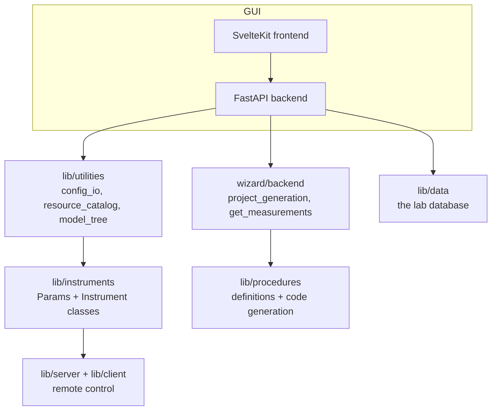
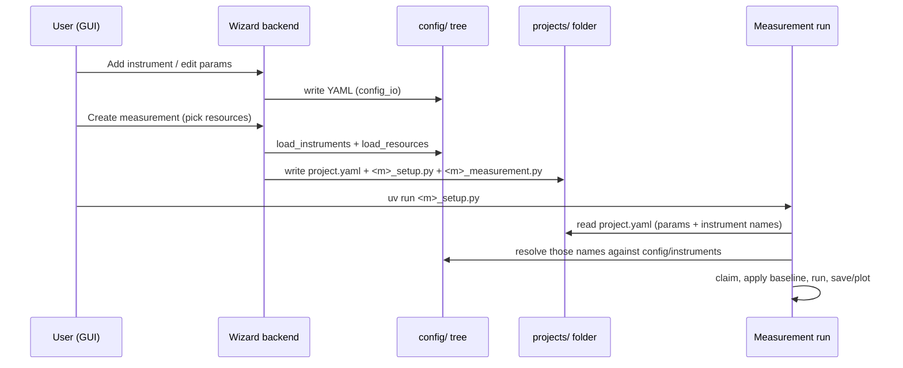

# Architecture

Lab Wizard separates cleanly into an installed **library**, a **GUI**, and a
user-owned **workspace**. The workspace config tree is the shared contract
between the library and GUI.

## The library / GUI split

- `lab_wizard/lib` is a standalone Python package. It knows nothing about the
  GUI. You can `import` it, build instruments, and run measurements with no web
  server involved. Generated measurement projects depend only on `lib`.
- `lab_wizard/wizard` is the GUI. Its backend is a FastAPI app
  ([`backend/main.py`](../../lab_wizard/wizard/backend/main.py)); its frontend is
  a pre-built SvelteKit static site served by that same app. The backend is a
  thin orchestration layer — almost every endpoint delegates to functions in
  `lib/utilities` or `wizard/backend`.

The GUI is a friendly editor for the config tree, a code generator, a launcher
for the projects it generates, and a viewer of the lab database they record
into. Nothing it does is magic — it writes YAML, generates Python you can read,
starts that Python as its own process, and reads `data/lab.db`.

Installed Python and compiled frontend files are immutable package resources.
`wizard init` creates `lab-wizard.toml` plus the mutable `config/`, `projects/`,
`logs/`, `data/` and `measurements/` directories outside the package. The same layout is used whether
the package is installed editable from this repository or from PyPI.

## The four layers


```mermaid
graph TD
    subgraph GUI
        FE[SvelteKit frontend] --> BE[FastAPI backend]
    end
    BE --> UTIL[lib/utilities<br/>config_io, resource_catalog, model_tree]
    UTIL --> INST[lib/instruments<br/>Params + Instrument classes]
    BE --> GEN[wizard/backend<br/>project_generation, get_measurements]
    GEN --> MEAS[lib/procedures<br/>definitions + code generation]
    INST --> SRV[lib/server + lib/client<br/>remote control]
    BE --> DATA[lib/data<br/>the lab database]
```

1. **Instrument layer** (`lib/instruments`) — the typed model of hardware. Every
   instrument is a pair: a Pydantic **`Params`** class (serializable config) and
   an **`Instrument`** class (live, talks to hardware). See
   [Instrument model](instrument-model.md).
2. **Utilities layer** (`lib/utilities`) — loads/saves the config tree
   (`config_io`), auto-discovers instrument types from source
   (`resource_catalog`), and parses project YAML into a runnable tree
   (`model_tree`). See [Config & discovery](config-and-discovery.md).
3. **Application layer** (`lib/procedures`, `lib/data`, `lib/savers`,
   `lib/plotters`, `lib/server`, `lib/client`) — what you actually do with instruments.
4. **GUI layer** (`wizard`) — editing and code generation on top of all the above.

## Params ↔ Instrument: the central duality { #params-instrument-the-central-duality }

This pattern recurs everywhere, so internalize it early:

| | `Params` (config) | `Instrument` (runtime) |
|---|---|---|
| What it is | A Pydantic model — pure data | A live object that talks to hardware |
| Serializable? | Yes (to/from YAML) | No |
| Has a `type` discriminator? | Yes (`type: Literal["dbay"]`) | No |
| Created by | parsing YAML | `params.create_inst()` / `Parent.make_child()` |
| Knows its runtime class? | Yes, via the `resource_class()` classmethod | — |

A `Params` object describes *what* an instrument is and how to reach it; calling
`create_inst()` (or `from_params(params)`) produces the live `Instrument`. This
keeps configuration declarative and hardware access lazy — you can load,
inspect, and edit the entire instrument tree without opening a single serial
port.

## Data flow: from config to a running measurement


```mermaid
sequenceDiagram
    participant U as User (GUI)
    participant W as Wizard backend
    participant C as config/ tree
    participant P as projects/ folder
    participant R as Measurement run

    U->>W: Add instrument / edit params
    W->>C: write YAML (config_io)
    U->>W: Create measurement (pick resources)
    W->>C: load_instruments + load_resources
    W->>P: write project.yaml + <m>_setup.py + <m>_measurement.py
    U->>R: uv run <m>_setup.py
    R->>P: read project.yaml (params + instrument names)
    R->>C: resolve those names against config/instruments
    R->>R: claim, apply baseline, run, save/plot
```

**A project names its instruments; it never copies their settings.** The YAML
says which instrument fills each role, by `attribute_name`, and where it lives;
the generated setup file says what class each role is:

```yaml
roles:
  voltage_source: sim928-brave-otter
```

```python
class Resources(measurement.IvCurveResources):
    voltage_source: Sim928
```

Which tree answers is the only difference between local and remote:

- **local** — this workspace's `config/instruments`, opened by the project's own
  process;
- **through a server** — the workspace that owns the instrument answers, and the
  project gets a [remote proxy](../remote/architecture.md). Chosen per
  instrument, including this workspace's own server.

So readdressing a rack or fixing a bench setting reaches every project without
regenerating anything, and one project can hold a local voltmeter while routing
a counter that a server already shares. The measurement code is identical in
every case because it consumes instruments through **behavior ABCs**
(`VSource`, `VSense`, `Counter`, `Attenuator`, `Laser`) that real instruments
and proxies both satisfy.

The exception is the [embedded generation style](../wizard/measurements.md#generation-styles),
which writes every setting into the Python so the project can run with no
workspace at all.

## The three workstation roles

A single machine can play any combination of three roles. The GUI is organized
around them, and the distinction matters for the config layout:

| Role | Meaning | Owns config in |
|---|---|---|
| **Host** | Drives local hardware; optionally runs a server exposing it with safety rules | `config/instruments/`, `config/server/` |
| **Consume** | Its measurements use instruments hosted on *other* machines | `config/remote/servers.yaml` |
| **Run** | Builds and runs measurement projects | `projects/` |

A key design decision follows from this: **permission rules are server-local**.
A safety interlock can only reference instruments hosted by the same server,
because the server only knows the state of instruments it controls. This matches
physics — interlocked instruments are wired into one experiment and naturally
co-located. See [Permissions](../remote/permissions.md).
