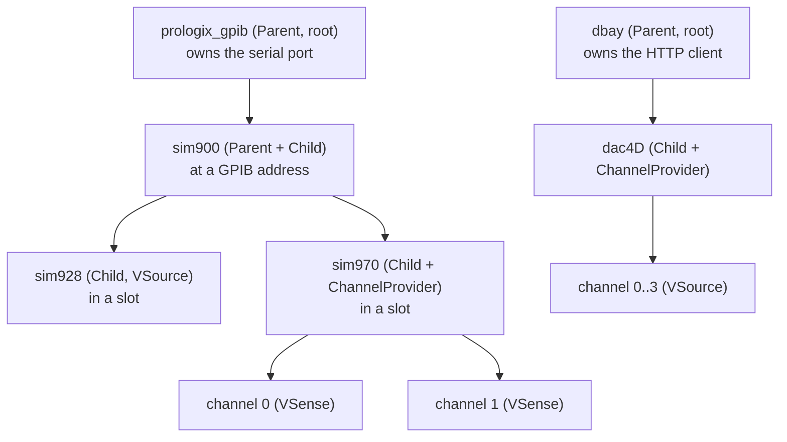

# The instrument model

Every instrument in Lab Wizard is modelled as a **`Params`/`Instrument` pair**
(see [Architecture](architecture.md#params-instrument-the-central-duality)).
This page explains the class hierarchy that makes that work, defined in
[`lib/instruments/general/parent_child.py`](../../lab_wizard/lib/instruments/general/parent_child.py).

## Parents, children, and channels

Real hardware is hierarchical: a Prologix GPIB controller owns a serial port and
hosts several GPIB instruments; a SIM900 mainframe hosts module cards in slots; a
DBay controller hosts DAC modules, each of which has output channels. Lab Wizard
models this with three building blocks.



### `Parent`

A [`Parent`](../../lab_wizard/lib/instruments/general/parent_child.py) owns a
**dependency** (`dep`) — the shared transport, e.g. a serial connection or HTTP
client — and creates children scoped to that dependency. The one method every
parent must implement is `make_child(key)`:

1. return the cached child if `key` is already built,
2. read `self.params.children[key]` for the child's `Params`,
3. derive the child's scoped dependency from its params (e.g. `params.slot`),
4. construct and cache the child.

`make_all_children()` is provided for free.

### `Child`

A [`Child`](../../lab_wizard/lib/instruments/general/parent_child.py) is created
by its parent. It declares one static property, `parent_class`, returning the
fully-qualified dotted path of its expected parent class:

```python
@property
def parent_class(self) -> str:
    return "lab_wizard.lib.instruments.dbay.dbay.DBay"
```

!!! warning "`parent_class` is read statically, not at runtime"
    `params_discovery` parses this string out of the **source code** with a regex
    (`_PARENT_CLASS_RETURN`) to build the parent/child map the GUI uses. It is
    never called at runtime. Renaming or removing it silently breaks discovery.

`Child.from_config(parent, key=...)` is concrete: it checks the parent's cache,
delegates to `parent.make_child(key)`, and type-checks the result.

### `ChannelProvider`

Some instruments manage a fixed collection of channel objects (a Dac4D has 4
output channels; a SIM970 has sensing channels). These mix in
[`ChannelProvider[ChanT]`](../../lab_wizard/lib/instruments/general/parent_child.py),
which provides `channels`, `num_channels`, `get_channel(i)`, indexing
(`inst[i]`), and iteration. Each channel object itself implements a behavior ABC
(e.g. `Dac4DChannel(VSource)`).

The channel **count and per-channel config** live in the parent's `Params`
(`channels: list[Dac4DChannelParams]`); each channel params can carry its own
`attribute_name`.

## Behavior ABCs: what an instrument *does*

Measurements never depend on a concrete instrument class. They depend on an
**abstract behavior**, so any instrument that implements that behavior is
interchangeable. The behaviors live in `lib/instruments/general`:

| Behavior ABC | Contract | Examples |
|---|---|---|
| [`VSource`](../../lab_wizard/lib/instruments/general/vsource.py) | `set_voltage`, `turn_on`, `turn_off` | `Sim928`, `Dac4DChannel` |
| [`VSense`](../../lab_wizard/lib/instruments/general/vsense.py) | `get_voltage` (+ `measure` alias) | `Sim970Channel` |
| [`Counter`](../../lab_wizard/lib/instruments/general/counter.py) | `count`, `set_gate_time` | photon counters |

Each behavior also ships a **stand-in** (`StandInVSource`, `StandInVSense`,
`StandInCounter`) — a no-hardware implementation used as the default in setup
templates and in tests. Stand-ins set `ignore_in_cli = True` so discovery skips
them.

Behavior ABCs are also the matching currency for both [instrument selection](../wizard/creating-measurements.md)
and the [permission gate](../remote/permissions.md): the server reports each
exposed instrument's `behavior_abc`, and that's matched against a measurement's
required resource types.

## Params mixins

### `CanInstantiate` and `ParentFactory`

- A **top-level** (root) instrument's `Params` inherits
  [`CanInstantiate`](../../lab_wizard/lib/instruments/general/parent_child.py) and
  implements `create_inst()` — it can be built with no external dependency.
- Its `Instrument` inherits `ParentFactory`, providing `from_params(params)` and
  `from_config(resources, key=...)`.

`params_discovery` keys off these: a `Params` class inheriting `CanInstantiate`
is a **top-level** instrument; one inheriting `ChildParams` is a **child**.

### KeyLike mixins — how addressing becomes a key

A top-level instrument needs a stable identity derived from its hardware address;
a child needs one derived from its slot/GPIB address. The **KeyLike** mixins
([`parent_child.py`](../../lab_wizard/lib/instruments/general/parent_child.py))
provide this uniformly:

| Mixin | Key field(s) | Example key value |
|---|---|---|
| `USBLike` | `port` | `/dev/ttyUSB0` |
| `IPLike` | `ip_address`, `ip_port` | `10.7.0.4:8345` |
| `SlotLike` | `slot` | `1` |
| `GPIBAddressLike` | `gpib_address` | `4` |

Each provides `key_fields()` (the raw address string) and `apply_key(key)` (write
that address back into the params). The config system hashes `key_fields()` into
an 8-char key — see [Config & discovery](config-and-discovery.md#hashing). Adding
a new addressing scheme is just a new mixin; `config_io` and the GUI pick it up
without changes because they only ever call `key_fields()`/`apply_key()`.

## A worked example: DBay → Dac4D → channels

From [`dbay/dbay.py`](../../lab_wizard/lib/instruments/dbay/dbay.py) and
[`dbay/modules/dac4d.py`](../../lab_wizard/lib/instruments/dbay/modules/dac4d.py):

```python
class DBayParams(IPLike, ParentParams["DBay", DBayClient, DBayChildParams],
                 CanInstantiate["DBay"], Discoverable):
    type: Literal["dbay"] = "dbay"
    ip_address: str = "10.7.0.4"
    ip_port: int = 8345
    children: dict[str, DBayChildParams] = Field(default_factory=dict)
    def create_inst(self) -> "DBay": return DBay.from_params(self)

class Dac4DParams(SlotLike, ChildParams["Dac4D"]):
    type: Literal["dac4D"] = "dac4D"
    channels: list[Dac4DChannelParams] = Field(
        default_factory=lambda: [Dac4DChannelParams() for _ in range(4)])

class Dac4DChannel(VSource):           # one channel = one VSource
    def set_voltage(self, voltage): self.module.set_voltage(self.channel_index, voltage)
```

Note the typed unions: `DBayParams.children` is a `dict[str, DBayChildParams]`
where `DBayChildParams` is an `Annotated[... , Field(discriminator="type")]`
union. Pydantic uses the `type` discriminator to parse each child into the right
class when loading YAML. **Every concrete `ParentParams` subclass must declare its
own typed `children` field** — the base class enforces this at class-creation
time.
