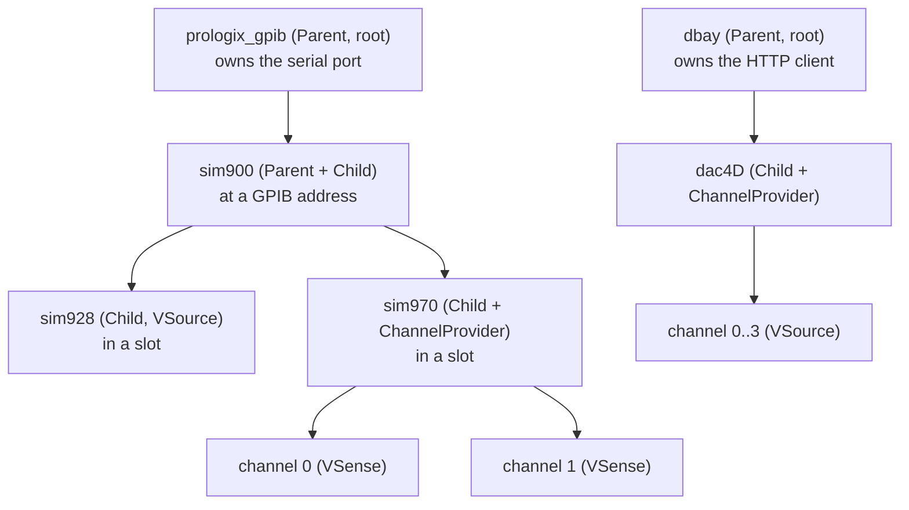

# The instrument model

Every instrument in Lab Wizard is modelled as a **`Params`/`Instrument` pair**
(see [Architecture](architecture.md#params-instrument-the-central-duality)).
This page explains the class hierarchy that makes that work, defined in
[`lib/instruments/general/parent_child.py`](../../lab_wizard/lib/instruments/general/parent_child.py).

## Parents, children, and channels

Real hardware is hierarchical: a Prologix GPIB controller owns a serial port and
hosts several GPIB instruments; a SIM900 mainframe hosts module cards in slots; a
DBay controller hosts DAC modules, each of which has output channels. Lab Wizard
models this with three building blocks.


```mermaid
graph TD
    PG["prologix_gpib (Parent, root)<br/>owns the serial port"] --> S9["sim900 (Parent + Child)<br/>at a GPIB address"]
    S9 --> S928["sim928 (Child, VSource)<br/>in a slot"]
    S9 --> S970["sim970 (Child + ChannelProvider)<br/>in a slot"]
    S970 --> CH0["channel 0 (VSense)"]
    S970 --> CH1["channel 1 (VSense)"]
    DBAY["dbay (Parent, root)<br/>owns the HTTP client"] --> D4D["dac4D (Child + ChannelProvider)"]
    D4D --> DCH["channel 0..3 (VSource)"]
```

### `Parent`

A [`Parent`](../../lab_wizard/lib/instruments/general/parent_child.py) owns a
**dependency** (`dep`) — the shared transport, e.g. a serial connection or HTTP
client — and creates children scoped to that dependency. The one method every
parent must implement is `make_child(key)`:

1. return the cached child if `key` is already built,
2. read `self.params.children[key]` for the child's `Params`,
3. derive the child's scoped dependency from its params (e.g. `params.slot`),
4. construct and cache the child.

`make_all_children()` is provided for free.

### `Child`

A [`Child`](../../lab_wizard/lib/instruments/general/parent_child.py) is created
by its parent. Its Params class inherits the nominal Params family accepted by
that parent:

```python
class DBayModuleParams(ChildParams[Any]): ...

class Dac4DParams(SlotLike, DBayModuleParams): ...
```

The parent's typed `children` field accepts that family. The runtime catalog
uses ordinary `issubclass` checks to build the graph, so there is no parallel
string hierarchy to keep synchronized. A new child joins the rack by inheriting
its family in its own Python file; the parent does not enumerate every concrete
child.

`Child.from_config(parent, key=...)` is concrete: it checks the parent's cache,
delegates to `parent.make_child(key)`, and type-checks the result.

### `ChannelProvider`

Some instruments manage a fixed collection of channel objects (a Dac4D has 4
output channels; a SIM970 has sensing channels). These mix in
[`ChannelProvider[ChanT]`](../../lab_wizard/lib/instruments/general/parent_child.py),
which provides `channels`, `num_channels`, `get_channel(i)`, indexing
(`inst[i]`), and iteration. Each channel object itself implements a behavior ABC
(e.g. `Dac4DChannel(VSource)`). A provider also declares the runtime-visible
`channel_class = Dac4DChannel`; normal subclasses inherit it.

The channel **count and per-channel config** live in the parent's `Params`
(`channels: list[Dac4DChannelParams]`); each channel params can carry its own
`attribute_name`.

## Behavior ABCs: what an instrument *does*

Measurements never depend on a concrete instrument class. They depend on an
**abstract behavior**, so any instrument that implements that behavior is
interchangeable. The behaviors live in `lib/instruments/general`:

| Behavior ABC | Contract | Examples |
|---|---|---|
| [`VSource`](../../lab_wizard/lib/instruments/general/vsource.py) | `set_voltage`, `turn_on`, `turn_off` | `Sim928`, `Dac4DChannel` |
| [`VSense`](../../lab_wizard/lib/instruments/general/vsense.py) | `get_voltage` (+ `measure` alias) | `Sim970Channel` |
| [`Counter`](../../lab_wizard/lib/instruments/general/counter.py) | `count`, `set_gate_time` / `get_gate_time`, `set_threshold` / `get_threshold` | `Keysight53220AChannel` |
| [`Attenuator`](../../lab_wizard/lib/instruments/general/attenuator.py) | `set_attenuation` / `get_attenuation`, `open_shutter` / `close_shutter`, `get_max_attenuation`, `enter_safe_state` | `YokoAttenuator`, `Attenuator31` |
| [`Laser`](../../lab_wizard/lib/instruments/general/laser.py) | `turn_on` / `turn_off` / `is_output_on`, `set_power_dbm` / `get_power_dbm`, `get_wavelength_nm`, `enter_safe_state` | `YokoLaser` |

Getters sit beside setters wherever the hardware quantizes or clamps: the value
asked for is not necessarily the value applied, and data is only interpretable
against the latter.

Each behavior also ships a **stand-in** (`StandInVSource`, `StandInVSense`,
`StandInCounter`, `StandInAttenuator`) — a no-hardware implementation used as the default in setup
templates and in tests. Stand-ins set `ignore_in_cli = True` so discovery skips
them.

Behavior ABCs are also the matching currency for both [instrument selection](../wizard/measurements.md)
and the [permission gate](../remote/permissions.md): the server reports each
exposed instrument's `behavior_abc`, and that's matched against a measurement's
required resource types.

## Params mixins

### `CanInstantiate` and `ParentFactory`

- A **top-level** (root) instrument's `Params` inherits
  [`CanInstantiate`](../../lab_wizard/lib/instruments/general/parent_child.py) and
  implements `create_inst()` — it can be built with no external dependency.
- Its `Instrument` inherits `ParentFactory`, providing `from_params(params)` and
  `from_config(resources, key=...)`.

The runtime catalog keys off these: a `Params` class inheriting `CanInstantiate`
is a **top-level** instrument; one inheriting `ChildParams` is a **child**.

### KeyLike mixins — how addressing becomes a key

A top-level instrument needs a stable identity derived from its hardware address;
a child needs one derived from its slot/GPIB address. The **KeyLike** mixins
([`parent_child.py`](../../lab_wizard/lib/instruments/general/parent_child.py))
provide this uniformly:

| Mixin | Key field(s) | Example key value |
|---|---|---|
| `USBLike` | `port` | `/dev/ttyUSB0` |
| `IPLike` | `ip_address`, `ip_port` | `10.7.0.4:8345` |
| `SlotLike` | `slot` | `1` |
| `GPIBAddressLike` | `gpib_address` | `4` |

Each provides `key_fields()` (the raw address string) and `apply_key(key)` (write
that address back into the params). The config system hashes `key_fields()` into
an 8-char key — see [Config & discovery](config-and-discovery.md#hashing). Adding
a new addressing scheme is just a new mixin; `config_io` and the GUI pick it up
without changes because they only ever call `key_fields()`/`apply_key()`.

## What belongs in `Params`

Not every setting an instrument accepts belongs in its params. There are three
kinds of value, and only the first two live on an instrument:

| Kind | Examples | Home | Changes when… |
|---|---|---|---|
| Connection / identity | `ip_address`, `port`, `slot`, `gpib_address` | instrument params | the device is replaced or readdressed |
| Bench wiring | `impedance_ohm`, `coupling`, `probe_factor`, `wavelength_nm` | instrument params | someone rewires the bench |
| Procedure | sweep bounds, gate time, settle time, the threshold a run counts at | the **measurement's** params | someone designs a different experiment |

**The test for a new field:** *if someone rewires the bench, does this value
change?* Then it is bench wiring, and it belongs here. *If someone runs a
different experiment on the same bench, does it change?* Then it is procedure,
and it belongs in the measurement's params model, handed to the instrument as a
method argument — `counter.count(gate_time)`, `counter.set_threshold(mV)` — not
stored on the instrument.

The mistake this prevents is concrete. The previous generation of this software
kept `config['counterInst']['triggerLevelStart']` beside the counter's
impedance — a sweep endpoint filed under an instrument — and a threshold sweep
then needs `triggerLevelEnd` and `triggerLevelStep` too. Every richer procedure
grows the instrument's config instead of the measurement's.
[`tests/test_params_categories.py`](../../tests/test_params_categories.py)
fails on any instrument params model with start/stop/step-shaped fields.

Two consequences for procedures:

- **A procedure sets every procedure value it depends on.** An instrument may
  still carry a default — `Keysight53220AChannelParams.gate_time_s` is what a
  bare `count()` uses — but a measurement never relies on it. On a server-held
  instrument, the current value is whatever the previous client left.
  `pcr_curve` sets its threshold at the start of every run for this reason.
- **Deviating from bench wiring is scoped.** A procedure that genuinely needs
  a different coupling or threshold for part of a run wraps that part in
  `WithSettings`, which reads each setting back, applies the override, and
  restores it on exit — including on failure and abort.

The repository's `plans/procedure_plan.md` carries the full rationale; it is a
working document rather than part of this site.

## A worked example: DBay → Dac4D → channels

From [`dbay/dbay.py`](../../lab_wizard/lib/instruments/dbay/dbay.py) and
[`dbay/modules/dac4d.py`](../../lab_wizard/lib/instruments/dbay/modules/dac4d.py):

```python
class DBayParams(IPLike, ParentParams["DBay", DBayClient, DBayChildParams],
                 CanInstantiate["DBay"], Discoverable):
    type: Literal["dbay"] = "dbay"
    ip_address: str = "10.7.0.4"
    ip_port: int = 8345
    children: dict[str, SerializeAsAny[DBayModuleParams]] = Field(default_factory=dict)
    def create_inst(self) -> "DBay": return DBay.from_params(self)

class Dac4DParams(SlotLike, DBayModuleParams):
    type: Literal["dac4D"] = "dac4D"
    channels: list[Dac4DChannelParams] = Field(
        default_factory=lambda: [Dac4DChannelParams() for _ in range(4)])

class Dac4DChannel(VSource):           # one channel = one VSource
    def set_voltage(self, voltage): self.module.set_voltage(self.channel_index, voltage)
```

`SerializeAsAny` retains every concrete child field during serialization.
Before field validation, `ParentParams` resolves raw child dictionaries through
the runtime catalog using their `type` discriminator. Pydantic then verifies
that the resolved class belongs to `DBayModuleParams`; a SIM900 module, for
example, is rejected even though it is otherwise a valid `ChildParams` class.
