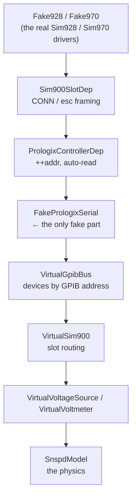

# Simulated instruments

A measurement can only be trusted end to end if something can run it end to end
without a cryostat. `lab_wizard/lib/instruments/fake_rack/` provides a rack of
instruments that behave like the real SIM900 hardware and are wired to a
simulated SNSPD, so a generated project can be executed — and its numbers
checked — in a test.

These are ordinary instruments as far as the rest of the system is concerned:
they are discovered by [params discovery](config-and-discovery.md), appear in
Manage Instruments, can be selected when creating a measurement, and are copied
into a generated project's YAML like any other.

| Type | Stands in for | Class |
|---|---|---|
| `fakegpib` | `prologix_gpib` | `FakeGpib` |
| `fake900` | `sim900` | `Fake900` |
| `fake928` | `sim928` (VSource) | `Fake928` |
| `fake970` | `sim970` (4 × VSense) | `Fake970` |

## The substitution happens at the serial port

The fakes are not mock objects with stubbed methods. `Fake928` **is**
`Sim928` — it inherits the driver whole, so it formats the same `VOLT 0.300`,
which the real `Sim900SlotDep` wraps in the same `CONN 1, "esc"`, which the
real `PrologixControllerDep` prefixes with the same `++addr 5`.

Only the last layer is replaced. `FakeGpib.from_params` builds a
`FakePrologixSerial` instead of opening pyserial, and that fake port parses the
byte stream as a Prologix controller would and routes it to virtual devices.



Two consequences worth knowing:

- **Malformed commands get silence, not a plausible number.** The virtual
  devices parse what they are sent; anything unrecognised produces no reply and
  the driver sees a read timeout. A driver that starts sending the wrong SCPI
  fails a test instead of quietly reading zeros.
- **The wire traffic is assertable.** `FakeGpib.bus.history` records every
  `(address, command)` in order, so a test can pin the protocol itself — the
  one thing a mocked instrument object can never check.

## The detector

`fake900` carries a `device:` block — an
[`SnspdModelParams`](../../lab_wizard/lib/instruments/fake_rack/snspd.py) — and
every module in that mainframe is wired to the one detector it describes. That
shared model *is* the circuit: the source in one slot sets the bias, the
voltmeter in another reads what the detector drops.

```
V_bias ──[ R_bias ]──┬── SNSPD ── gnd
                     │
                  voltmeter
```

Below the switching current the detector is a short: it drops nothing, and the
voltmeter reads zero. At `critical_current_a` superconductivity breaks and a
normal-conducting hotspot of `normal_resistance_ohm` appears in series, so the
voltmeter reads a nonzero voltage that rises monotonically with bias. It stays
latched until the current falls below `retrapping_current_a` — which is *lower*
than the critical current, which is why a real IV curve is hysteretic and the
downward sweep does not retrace the upward one.

The throwaway model fixes its bias resistor at 100 kΩ, matching the IV
measurement default without adding a simulation-only field to project YAML.
With the default 0.3 µA critical current, the transition lands at 0.03 V.

`noise_volts` defaults to 0, making runs exactly reproducible; set it (with
`seed`) to exercise code that has to cope with a jittery reading.

## Using them

Add a `fakegpib` in Manage Instruments — its "scan" action offers a simulated
controller rather than probing USB — then add a `fake900` under it and
`fake928`/`fake970` modules in slots, exactly as for a real rack. Generate a
measurement against them and the project runs on any machine.

The model's fixed resistor matches
`measurement.params.readout.bias_resistance_ohm` in a default IV project, so
the generic project generator needs no knowledge of simulated instruments.

`tests/test_iv_curve_end_to_end.py` does the whole loop — writes a config,
generates a project, runs the generated `iv_curve_setup.py`, and checks the
measured curve against the model's own physics.

!!! warning "They declare themselves exclusive"
    A simulated rack claims `transport_sharing = "exclusive"` and a
    `transport_key` even though nothing physical is at stake, so the preflight
    and single-owner machinery is exercised rather than bypassed. Their `*IDN?`
    strings all begin `Lab_Wizard_Simulation`, so a simulated rack can never be
    mistaken for hardware.
