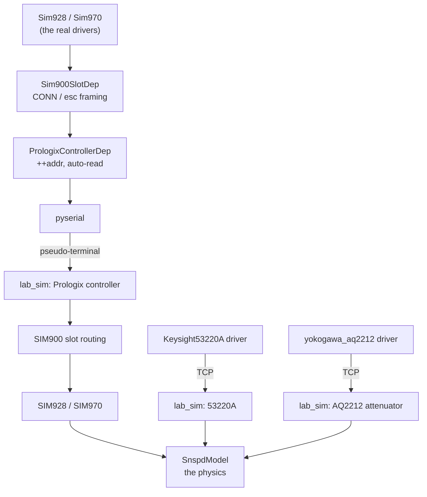

# Simulated instruments

A measurement can only be trusted end to end if something can run it end to end
without a cryostat. `lab-sim` is that something: a small program, separate from
the wizard, that serves a simulated SNSPD test bench on this computer. The
wizard talks to it with its ordinary drivers, exactly as it talks to the lab's
real instruments, and nothing in lab_wizard knows that the instruments are
simulated.

```bash
uv run lab-sim              # the standard bench
uv run lab-sim bench.yaml   # your own detector and ports
```

It prints where each instrument can be found:

```text
Simulated bench running. Add these instruments in lab_wizard:
  prologix_gpib    port: /Users/you/.lab_sim/prologix   (-> /dev/ttys004)
    sim900         gpib_address: 5
      sim928       slot: 1
      sim970       slot: 2   (detector on its channel 1: channel index 0 in lab_wizard)
  keysight53220A   ip_address: 127.0.0.1  ip_port: 5025
  yokogawa_aq2212  ip_address: 127.0.0.1  ip_port: 50000
    yoko_attenuator  slot: 1
```

Add those under [Instruments](../wizard/instruments.md) as you would the real
ones, and a generated project runs on any machine. The code lives in
`simulator/` at the top of the repository, as its own package (`lab_sim`).

## The bench

One detector, and the instruments a test setup in the lab would have on it:

| Instrument | Stands in for | Reached over |
|---|---|---|
| Prologix GPIB-USB controller | the rack's USB adapter | a serial port |
| SIM900 mainframe, with a SIM928 source and a SIM970 voltmeter | the bias rack | GPIB, through the controller |
| Keysight 53220A counter | the counter on the detector's output | TCP |
| Yokogawa AQ2212 with an attenuator module | the attenuator in the light path | TCP |

They share the one detector the way the real ones share a device under test:
the source biases it, the voltmeter reads the voltage across it, the counter
counts its pulses, and the attenuator decides how much light reaches it.

Everything about the detector lives in the simulator's own YAML file, never in
lab_wizard's configuration. Every field has a default, so an empty file is the
standard bench:

```yaml
detector:
  critical_current_a: 3.0e-7
  bias_resistance_ohm: 1.0e5
  noise_volts: 1.0e-5
prologix:
  link: ~/.lab_sim/prologix
  gpib_address: 5
counter:
  port: 5025
attenuator:
  port: 50000
  slot: 1
```

## The substitution happens below the driver

The simulator stands in for hardware, not for the drivers. A measurement
talks to the real `Sim928`, which formats the same `VOLT 0.300`, which the real
`Sim900SlotDep` wraps in the same `CONN 1, "esc"`, which the real
`PrologixControllerDep` prefixes with the same `++addr 5`, which pyserial
writes to a serial port, as it always does.

That serial port is a **pseudo-terminal**: a serial port with a program instead
of a cable on the other end. The simulator opens one and links it at a stable
path (`~/.lab_sim/prologix`), so you configure the Prologix controller with
that path where you would otherwise put `/dev/tty.usbserial-…`. The driver opens
it exactly as it opens the USB adapter, exclusive lock included, so a second
program trying to open the same port is refused, as it would be with the real
one. Only the USB adapter itself isn't exercised.

The counter and the attenuator are network instruments anyway, so they get
real TCP ports on `127.0.0.1`, and their drivers open real VISA sessions.


```mermaid
graph TD
    D["Sim928 / Sim970<br/>(the real drivers)"] --> SD["Sim900SlotDep<br/>CONN / esc framing"]
    SD --> PC["PrologixControllerDep<br/>++addr, auto-read"]
    PC --> PS["pyserial"]
    PS -->|pseudo-terminal| FS["lab_sim: Prologix controller"]
    FS --> MF["SIM900 slot routing"]
    MF --> MOD["SIM928 / SIM970"]
    MOD --> MODEL["SnspdModel<br/>the physics"]
    K["Keysight53220A driver"] -->|TCP| KS["lab_sim: 53220A"]
    Y["yokogawa_aq2212 driver"] -->|TCP| YS["lab_sim: AQ2212 attenuator"]
    KS --> MODEL
    YS --> MODEL
```

Consequences worth knowing:

- **Malformed commands get silence, not a plausible number.** The simulated
  instruments parse what they are sent; anything unrecognised produces no reply
  and the driver sees a read timeout. A driver that starts sending the wrong
  commands fails a test instead of quietly reading zeros.
- **Commands are handled in the order the drivers meant.** A driver that sets
  the bias over the serial port and then reads the counter over TCP has sent
  those in that order, but on two connections nothing makes them arrive in it.
  The simulator serves every connection from one thread, and any command that
  asks a question waits until everything already sent on the other
  connections has been handled. A reading is never taken ahead of a change
  made just before it.
- **It identifies itself as real hardware, with `SIMULATED` for a serial
  number**, for example `Stanford_Research_Systems,SIM900,s/n SIMULATED,ver3.6`.
  The wizard's own scans recognise it, and nobody mistakes it for the real rack.

## The detector

```
V_bias ──[ R_bias ]──┬── SNSPD ── gnd
                     │
                  voltmeter
```

Below the switching current the detector is a short: it drops nothing, and the
voltmeter reads zero. At `critical_current_a` superconductivity breaks and a
normal-conducting hotspot of `normal_resistance_ohm` appears in series, so the
voltmeter reads a nonzero voltage that rises monotonically with bias. It stays
latched until the current falls below `retrapping_current_a`, which is *lower*
than the critical current. That is why a real IV curve is hysteretic and the
downward sweep does not retrace the upward one.

`bias_resistance_ohm` defaults to 100 kΩ, matching the IV procedure's default,
so the standard detector switches at 0.03 V applied.

The counter sees what the detector would put out. Detection efficiency turns on
with bias as an error function, dark counts double every
`dark_count_doubling_current_a`, and a latched detector emits nothing. A pulse
is the bias current diverted into the readout, so its height grows with the
bias, reaching `pulse_amplitude_mV` at the critical current; the discriminator
passes the pulses taller than its trigger level. So a higher trigger turns on
at a higher bias. The readout's own noise (`readout_noise_rms_mV`) triggers
the counter too, at a rate falling as `exp(-T²/2σ²)` with the trigger level
`T`, so only a trigger near the noise counts it: a noise floor at every bias.
Counts are drawn from a Poisson distribution, seeded, so a run is reproducible.
`pcr_trigger_levels` shows both effects.

The attenuator scales the light reaching the detector by `10 ** (-dB / 10)`,
and closing its shutter blocks it entirely. Dark counts are unaffected, so a
closed-shutter count measures the background. Like the hardware, it clamps to
its maximum and quantizes to 0.001 dB.

`noise_volts` defaults to 0, making runs exactly reproducible. Set it (with
`seed`) to exercise code that has to cope with a jittery reading.

## In tests

Tests start the same bench inside the test process, one per test, on free
ports and a temporary link. That way no port one test leaves open blocks the
next, and every detector starts cold. The `rig` fixture in `tests/conftest.py`
provides it, along with the lab_wizard config that points at it. A test can
also reach past the wire: `rig.model` is the detector, and
`rig.bench.gpib.history` is every command the rack was sent.

`tests/test_iv_curve_end_to_end.py` does the whole loop. It writes a config,
generates a project, runs the generated setup file, and checks the measured
curve against the model's own physics. `tests/test_mcr_curve.py` does the same
with the counter and the attenuator.
