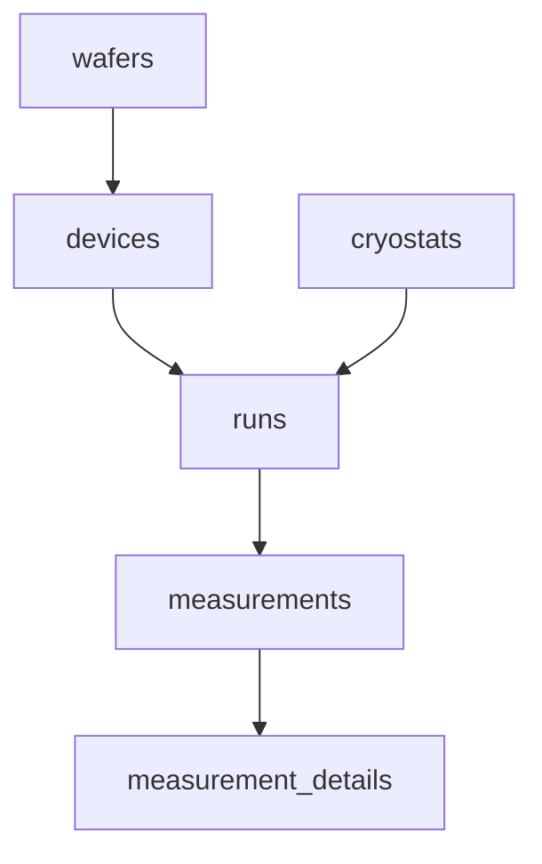

# The measurement database

The `database_saver` persists measurement data to **SQLite** via SQLAlchemy. It
is the one fully-implemented saver. Schema:
[`savers/schema.py`](../../lab_wizard/lib/savers/schema.py); runtime:
[`savers/database_saver.py`](../../lab_wizard/lib/savers/database_saver.py).

## The core idea: flat data, decoupled from execution

Measurement *execution* is naturally hierarchical (sweep thermal powers, and at
each, sweep trigger levels). But the *data* is fundamentally flat: each
integration produces **one observation**, tagged with every condition under which
it was taken. Whether the inner loop was `thermal_power` or `trigger_level` is
invisible in the data — which is exactly what lets you slice the dataset
arbitrarily after the fact.

So: **one row per integration.** A "PCR curve" sweeping 20 trigger levels at 5
thermal powers is 100 rows. The curve doesn't exist as a stored object — it's a
query result.

## Schema

Six tables forming a hierarchy, with `cryostats` hanging off `runs`:



| Table | One row = | Key columns |
|---|---|---|
| `wafers` | a fabricated wafer | `name`, `material` |
| `devices` | a device on a wafer | `wafer_id`, `name`, `pixel_geometry`, `width_nm` |
| `cryostats` | a cryostat | `name`, `location` |
| `runs` | one measurement program invocation | `cryostat_id`, `device_id`, `run_type`, `started_at`, `config` (JSON) |
| `measurements` | **one integration** | `run_id`, `timestamp`, `counts`, `int_time`, `temperature`, `metadata` (JSON) |
| `measurement_details` | sub-structure of one integration (histogram bins, time windows) | `measurement_id`, `detail_type`, `bin_index`, `value` |

Design principles baked into the schema:

- **Each fact lives in one place.** A run is one device, so `device_id` lives on
  `runs`, not on each measurement. "All measurements on device A7" is a join.
- **Real columns for what you query often** (`counts`, `temperature`,
  `int_time`); **JSON `metadata`** for the varying parameters that differ per
  run type (`bias_current`, `trigger_level`, `thermal_power`). A JSON field can be
  promoted to a real indexed column later if you query it constantly.
- **`run_type` is an Enum** (`pcr_curve`, `iv_curve`, `mcr_curve`,
  `extended_pcr`, `other`) — a soft constraint that catches typos.

Indexes exist on `runs(cryostat, started_at)`, `runs(run_type)`, and
`measurements(timestamp)`.

## Using it

Configure a `database_saver` instance on the [Manage Savers](../wizard/savers-and-plotters.md)
page (`db_path`, `cryostat_name`), then select it when creating a measurement.
The runtime API:

```python
saver.start_run(run_type="pcr_curve", device="A7", cryostat="BlueFors-1",
                operator="me", config={"git_sha": "...", "bias": 12.5})
# ... per integration:
saver.write_measurement(
    counts=14823, int_time=1.0, delta_time=1.02, temperature=2.13,
    metadata={"thermal_power": 3.0, "trigger_level": 0.034, "bias_current": 12.5},
    details=[{"detail_type": "histogram_bin", "bin_index": i,
              "bin_value": centers[i], "value": hist[i]} for i in ...],
)
saver.end_run()
```

[`DatabaseSaver`](../../lab_wizard/lib/savers/database_saver.py) auto-creates the
cryostat and device by name on first reference, opens one `runs` row on
`start_run`, and commits **one `measurements` row per `write_measurement`** — so
each completed integration is durable on disk before the next starts (a real
liability mitigation against power blips and Ctrl-C). `end_run` stamps
`ended_at`.

## Why SQLite

For a dozen runs/day across a few cryostats: one file means trivial backups
(`cp measurements.db backup.db`), no server to maintain, fine concurrent reads,
and incremental durable writes during long measurements. SQLAlchemy abstracts the
backend, so moving to Postgres later (if many machines need concurrent writes)
is mostly a connection-string change.

!!! note "Reading the data"
    `database_plan.md` (repo root) sketches a thin `query.py` of pandas helpers
    (`get_measurements`, `get_runs`, `get_histogram`) and a `measurements_full`
    SQL view that joins run/device/wafer/cryostat metadata. The query helpers and
    Alembic migrations are **not yet implemented** — see the [Roadmap](../roadmap.md).
