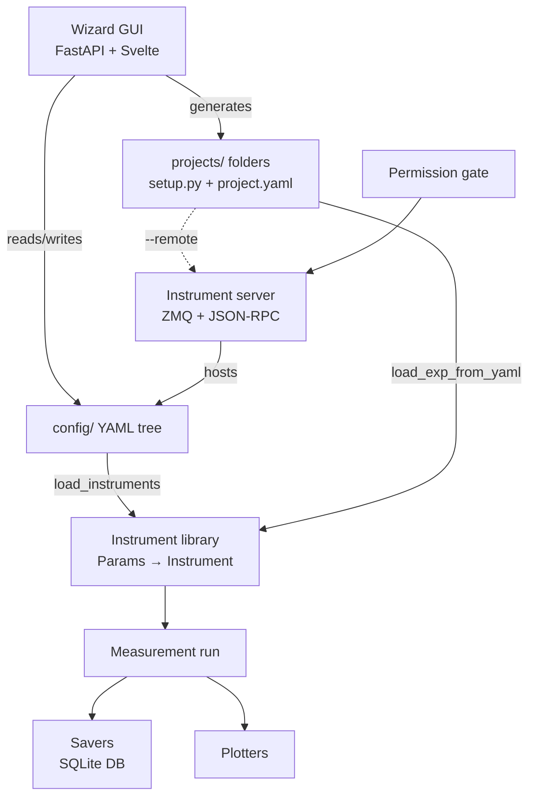

# Lab Wizard

Lab Wizard is an experiment-setup toolkit for SNSPD (superconducting nanowire
single-photon detector) measurement workflows, built by the JPL SNSPD group.

It is two things in one repository:

- **A typed instrument library** (`lab_wizard/lib`) — Pydantic-modelled
  instruments with a parent/child/channel hierarchy, a YAML-backed configuration
  tree, savers, plotters, and a remote-control server/client.
- **A wizard GUI** (`lab_wizard/wizard`) — a local desktop app (FastAPI backend +
  SvelteKit frontend in a `pywebview` window) that guides the lab workflow:
  configure instruments, set safety permissions, and generate runnable
  measurement projects.

The design goal: make experiment setup **repeatable and explicit** while keeping
both the configuration and the generated code easy to inspect and modify by hand.

!!! info "These docs describe the code as it is"
    This documentation set was written against the current source tree, not the
    older planning documents scattered around the repo. Where a feature is
    designed but not yet built, it is called out in the [Roadmap](roadmap.md).

## How the pieces fit together

## Where to go next

| If you want to… | Read |
|---|---|
| Install and launch the wizard | [Getting started](getting-started.md) |
| Understand the overall design | [Architecture](concepts/architecture.md) |
| Understand how an instrument is modelled | [Instrument model](concepts/instrument-model.md) |
| Understand the on-disk config tree | [Config & discovery](concepts/config-and-discovery.md) |
| Learn the GUI pages and workflows | [The wizard GUI](wizard/index.md) |
| Run measurements on a remote machine's instruments | [Remote control](remote/architecture.md) |
| Set up safety interlocks | [Permissions](remote/permissions.md) |
| Store and query measurement data | [Database](data/database.md) |
| See what's unfinished | [Roadmap](roadmap.md) |
