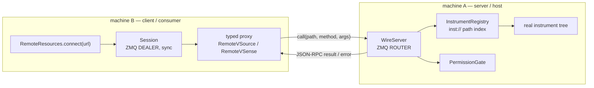

# Remote control

Lab Wizard can run a measurement on **machine B** against instruments physically
attached to **machine A**, with the measurement code unchanged. Rather than
tunnelling raw SCPI/USB bytes, it does **RPC at the user-API layer**: machine A
runs a **server** hosting the real instrument tree and exposing every method
(`set_voltage`, `get_voltage`, …) over ZMQ + JSON-RPC; machine B runs a
**client** holding typed proxies that forward calls.

## Why this design

- The proxy satisfies the same [behavior ABC](../concepts/instrument-model.md#behavior-abcs-what-an-instrument-does)
  the measurement consumes, so the measurement can't tell local from remote.
- One server can **multiplex a single VISA/serial connection** across multiple
  client programs (you can't open two sessions to one VISA resource).
- A server-side [permission gate](permissions.md) can block unsafe calls
  centrally, where it actually knows instrument state.

## The pieces



### Server (`lib/server/`)

| File | Role |
|---|---|
| [`registry.py`](../../lab_wizard/lib/server/registry.py) | `InstrumentRegistry`: indexes the tree by `inst://` path and by `attribute_name`; resolves objects lazily |
| [`wire.py`](../../lab_wizard/lib/server/wire.py) | `WireServer`: ZMQ ROUTER loop + pyleco framing + JSON-RPC dispatch + gate integration |
| [`permissions.py`](../../lab_wizard/lib/server/permissions.py) | the [permission state machine](permissions.md) |
| [`server.py`](../../lab_wizard/lib/server/server.py) | CLI entry point: load config → build registry + gate → serve |

The wire format is a pyleco `Message` (multipart, conversation-id) carrying
JSON-RPC 2.0 via pyleco's `RPCServer`. A ZMQ `ROUTER` socket is bound directly —
pyleco's `Coordinator`/`MessageHandler` layer is deliberately **not** used, but
the wire format is identical so migrating later is additive.

RPC methods: `call`, `list_paths`, `list_attributes`, `describe_path`,
`describe_attribute`, `list_descriptions`. Permission denials are JSON-RPC error
**code `-32001`** carrying `{rule_id, blocking_state}`.

### Client (`lib/client/`)

| File | Role |
|---|---|
| [`remote_resources.py`](../../lab_wizard/lib/client/remote_resources.py) | `RemoteResources.connect(url)`, `from_attribute(name, as_type=...)` |
| [`session.py`](../../lab_wizard/lib/client/session.py) | `Session`: sync DEALER socket, error→exception mapping |
| `proxies/base.py` | `RemoteProxy` mixin — auto-forwards inherited abstract methods over the wire |
| `proxies/vsource.py`, `vsense.py` | `RemoteVSource(VSource, RemoteProxy)`, `RemoteVSense(VSense, RemoteProxy)` |
| `proxies/registry.py` | maps a `behavior_abc` string → proxy class |

When you call `resources.from_attribute("bias")`, the client asks the server to
`describe_attribute("bias")`, gets back the `inst://` path and `behavior_abc`,
and builds the matching proxy (`RemoteVSource`, etc.). The proxy auto-generates a
forwarder for every abstract method of its ABC, so `proxy.set_voltage(0.5)`
becomes `call("inst://…", "set_voltage", [0.5])` over the wire.

## The `inst://` path scheme

The registry addresses every node with a path built from the config hash keys:

```text
inst://<root_key>[/<child_key>]*[/channel/<idx>]

inst://2da0863e                          DBay root
inst://2da0863e/a0da5bfa                 Dac4D child
inst://2da0863e/a0da5bfa/channel/1       Dac4DChannel (a VSource)
inst://7bf897f7/d6f1dcc9/c7fe1259        Sim970 child
```

## What the server hosts

The server's default mode (`from_config_dir`) hosts the **entire
`config/instruments` tree** for the workstation — it's "this machine's instrument
daemon." It:

- runs the same [hash repair](../concepts/config-and-discovery.md#hashing) the
  wizard runs, so its paths agree with what the GUI shows;
- builds the `inst://` index and `attribute_name` index **lazily** — listing or
  describing what it can provide never opens hardware;
- instantiates a live instrument only on the **first `call`** that resolves its
  path, then caches it.

`list_attributes` / `list_descriptions` return every local instrument that has an
`attribute_name`. `attribute_name` is therefore the single contract between
**hosting** (what the server exposes), **consuming** (what clients request), and
**permissions** (what rules reference).

!!! note "Optional single-project override"
    `server.yaml` can instead point at a single project's `exp_yaml`, which the
    server hosts eagerly (opening hardware up front). This is a legacy/override
    path; the config-dir mode is the norm.

See [Operations](operations.md) for how to run the server, and
[Permissions](permissions.md) for the safety gate.
