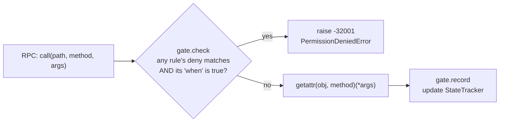

# Permissions & safety rules

The instrument server can **block unsafe calls** — e.g. "don't pulse the function
generator while the cryo amplifier bias is on." This is implemented as a
**rule list with declarative state**, not a full finite-state machine. The
implementation is [`lib/server/permissions.py`](../../lab_wizard/lib/server/permissions.py);
the GUI vocabulary comes from [`permissions_api.py`](../../lab_wizard/wizard/backend/permissions_api.py).

## The model



Two halves:

1. **State tracking.** Instruments declare which of their methods change
   safety-relevant state. After every successful call the server records the new
   state value, keyed by `(inst_path, state_key)`.
2. **Rule evaluation.** Before dispatching any call, the gate checks every rule:
   if the call matches one of the rule's `deny` clauses **and** the rule's `when`
   condition is currently true, the call is denied.

It's a **blocklist**: everything is allowed unless a rule denies it.

## Declaring state: `_state_methods_`

State observation is opt-in per instrument via a `_state_methods_` class
attribute, defined using the dependency-free vocabulary in
[`state_effects.py`](../../lab_wizard/lib/instruments/general/state_effects.py)
(so instruments never import server code):

```python
class VSource(ABC):
    _state_methods_ = {
        "set_voltage": ("voltage", Arg(0)),  # record args[0] under "voltage"
        "turn_on":     ("output",  "on"),    # record the literal "on"
        "turn_off":    ("output",  "off"),
    }
```

Each entry maps `method → (state_key, value_spec)`, where `value_spec` is one of
`Arg(i)`, `Kwarg(name)`, `Result()`, or a literal. Declarations are **merged
across the MRO** (`collect_state_methods`), so a behavior ABC declares the general
case once and a subclass overrides only what differs. For example
[`Dac4DChannel`](../../lab_wizard/lib/instruments/dbay/modules/dac4d.py) has no
separate output enable, so it overrides `turn_on`/`turn_off` to record
`voltage = 0.0` while inheriting `set_voltage` from `VSource`.

## Authoring rules

Rules live under `permissions:` in
[`config/server/server.yaml`](../../lab_wizard/config/server/server.yaml). A
worked example:

```yaml
permissions:
  state_defaults:
    cryo_amp_bias: { output: "off" }
  rules:
    - id: cryo_amp_safety
      description: "Don't pulse while the cryo amp is biased on."
      when:
        all:
          - { attribute: cryo_amp_bias, key: output, equals: "on" }
      deny:
        - { attribute: pulse_gen, methods: [pulse, burst] }
      message: "Cryo amp is biased on; disable it before pulsing."
```

- A **`when` condition** is a composable predicate over recorded state. Leaves
  reference an instrument (by `attribute` or raw `path`) plus a `key`, with one
  operator: `equals`, `not_equals`, `greater_than`, `less_than`, `in`, or bare
  truthiness. Composites: `all`, `any`, `not`.
- A **`deny` clause** matches a `(path, method)` pair: specify exactly one of
  `attribute`, `path`, or `path_glob`, plus the `methods` list.

### Reference instruments by `attribute_name`

Conditions and deny clauses should reference instruments by **`attribute`** (the
[stable handle](../concepts/config-and-discovery.md#hashing)), not by raw
`inst://` path. Attribute names are resolved to concrete paths once, at gate
construction (`resolve_attributes`). Raw paths are volatile — a slot/port edit
changes the hash — so attribute references are the safer, recommended form. (Raw
`path`/`path_glob` remain supported for advanced use.)

## The Manage Permissions page

`/manage_permissions` builds rules without hand-editing YAML.
[`permissions_api.py`](../../lab_wizard/wizard/backend/permissions_api.py)
introspects the **same `config/instruments` tree the server hosts** (in lazy mode,
no hardware opened) and offers, per instrument:

- the **state keys** it can be conditioned on — exactly the keys its class
  declares via `_state_methods_` (`collect_state_methods`), and
- the **methods** it can be denied — the public methods defined in the instrument
  layer for that class.

So the same mechanism that enforces rules also supplies the UI's vocabulary —
there's no separate schema to maintain.

`GET /api/permissions` returns the tree + this vocabulary + the current
`permissions:` block. `PUT /api/permissions` validates and persists it:
structurally (must parse as a `PermissionsConfig`) and **referentially** (every
referenced `attribute_name` must exist in the hosted tree), so a typo fails
loudly at save time rather than silently disabling a safety rule.

## Scope: rules are server-local

A rule can only reference instruments **hosted by the same server**, because the
gate only knows a state value if a call *through that server* recorded it. This
isn't just an implementation limit — interlocked instruments are electrically
tied into one experiment and naturally hosted by the one server next to that
rack. **Cross-server interlocks are out of scope.**
