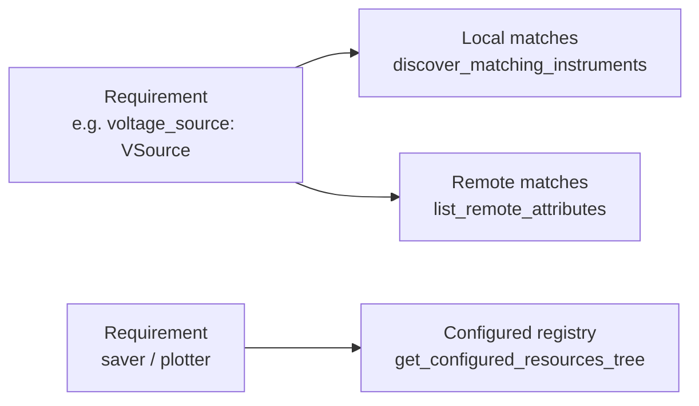

# Creating measurements

**Create Measurement** (`/get_measurements`) is the core wizard workflow: pick a
measurement template, assign each resource it needs a configured instrument /
saver / plotter, and generate a runnable project folder. This page explains how
the matching and code generation work.

## How a measurement declares what it needs

A measurement lives in `lib/measurements/<name>/` and has two files:

- `<name>.py` — the measurement class (the run logic), and
- `<name>_setup_template.py` — a template the wizard fills in.

The template defines a `@dataclass` ending in `Resources` whose **annotations**
declare the required resources. From
[`iv_curve_setup_template.py`](../../lab_wizard/lib/measurements/iv_curve/iv_curve_setup_template.py):

```python
@dataclass
class IVCurveResources:
    # wizard:resource_fields:start
    savers: list[GenericSaver] = field(default_factory=list)
    plotters: list[GenericPlotter] = field(default_factory=list)
    voltage_source: VSource = field(default_factory=StandInVSource)
    voltage_sense: VSense = field(default_factory=StandInVSense)
    # wizard:resource_fields:end
    params: IVCurveParams = field(default_factory=IVCurveParams)
```

[`get_measurements.py`](../../lab_wizard/wizard/backend/get_measurements.py)
reads these annotations and classifies each field:

- a field typed as a subclass of `GenericSaver` → a **saver** requirement,
- a subclass of `GenericPlotter` → a **plotter** requirement,
- anything else (a behavior ABC like `VSource`) → an **instrument** requirement.

`list[T]` annotations are recognized (e.g. `savers: list[GenericSaver]`), and
`params` is skipped.

## Matching resources to requirements

`GET /api/get-resources/{name}` returns, for each requirement, the candidates the
user can pick from:



- **Instruments** are matched by **class hierarchy**:
  [`discover_matching_instruments`](../../lab_wizard/wizard/backend/get_measurements.py)
  imports every class under `lib/instruments` and keeps the ones that are a
  subclass of the required behavior ABC. So a `VSource` requirement offers
  `Sim928`, `Dac4DChannel`, etc. — and crucially, it offers the **configured
  instances** of those from your tree.
- **Remote instruments** matching the requirement's behavior ABC are pulled from
  registered [remote servers](../remote/operations.md) and offered alongside
  local ones (matched by `behavior_abc` name).
- **Savers/plotters** are offered from their flat config registries — you pick a
  configured instance by name.

This is the answer to *"how are instruments chosen for measurements based on
generic instruments?"*: the measurement asks for a **behavior** (the generic ABC),
and the wizard offers every configured instrument that **is-a** that behavior.

## Generating the project

`POST /api/create-measurement-project` (→
[`generate_measurement_project`](../../lab_wizard/wizard/backend/project_generation.py))
does two things:

1. **Writes a project YAML** containing only the *subset* of config you selected
   — the chosen instrument lineages (leaf back to root), savers, and plotters —
   plus a `device` block and measurement defaults. This is a self-contained
   snapshot, so the project keeps working even if the central config changes.
2. **Fills in the setup template** by replacing the `# wizard:<block>:start/end`
   regions:
   - `imports` — concrete instrument/saver/plotter imports,
   - `resource_fields` — the dataclass field declarations,
   - `instantiation` — the construction lines,
   - `return_fields` — wiring the constructed objects into the `Resources`.

The project folder is timestamped, e.g. `projects/iv_curve_20260528_143012/`,
containing `<folder>.yaml` and `<name>_setup.py`.

### Two generation styles

The request's `generation_style` selects how instruments are constructed in the
generated code:

| Style | Construction line | When to use |
|---|---|---|
| `explicit` (default) | `voltage_source_1 = Sim928.from_config(resources, key="c7fe1259")` | local hardware on this machine |
| `from_attribute` | `voltage_source_1 = resources.from_attribute("bias_source")` | works against either a local `Exp` **or** a remote server |

`from_attribute` requires the selected instrument to have an `attribute_name`
set. Multi-channel instruments resolve to `base.channels[i]` (explicit) or the
channel's `attribute_name` (from_attribute).

## Running the generated project

```bash
cd projects/iv_curve_20260528_143012
python iv_curve_setup.py             # local: loads the project YAML
python iv_curve_setup.py --remote tcp://lab-server:12300   # remote
```

The template's `__main__` block builds either an `Exp` (from the project YAML) or
a `RemoteResources` (from `--remote`), constructs the resources, and runs the
measurement. The same code runs both ways because measurements consume behavior
ABCs, which both local instruments and [remote proxies](../remote/architecture.md)
satisfy.

!!! warning "Measurement run-logic is not yet wired to savers/plotters"
    The wizard correctly *plumbs* savers and plotters into the generated
    `Resources`, but the current measurement classes (e.g.
    [`iv_curve.py`](../../lab_wizard/lib/measurements/iv_curve/iv_curve.py)) do not
    yet call `saver.write_measurement(...)` or `plotter.plot(...)`, and reference
    some legacy attributes that no longer exist. Treat the measurement classes as
    in-progress. See the [Roadmap](../roadmap.md).
