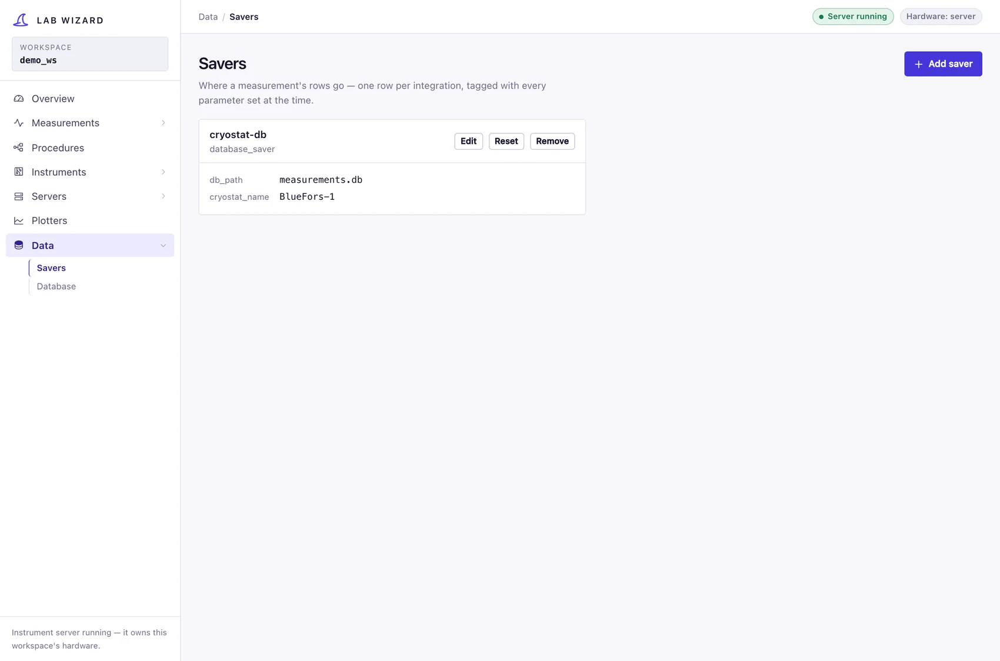

# Data

The **Data** section is where a run's output is configured and read back:
**Savers** decide where measurements are written, and **Database** browses what
has been written.

## Savers

A saver is a [flat resource](../concepts/config-and-discovery.md#flat-resources)
— no hardware addressing, no hierarchy — stored as one YAML file per configured
instance in `config/savers/`. Configure an instance here, then bind it while
[creating a measurement](measurements.md).

| Type | Class | Status |
|---|---|---|
| `database_saver` | [`DatabaseSaver`](../../lab_wizard/lib/savers/database_saver.py) | **working** — SQLite, one row per point of a run |
| — | `StandInSaver` | deliberate no-op, for tests and scaffolding |

There is **no file (CSV/HDF5/Parquet) saver** yet. Dropping a
`FileSaverParams`/`FileSaver` pair into `lib/savers/` would be
[discovered](../concepts/config-and-discovery.md#type-discovery) automatically.

### What a saver receives

A run publishes three kinds of message on its data bus, and
[`SaverSink`](../../lab_wizard/lib/task_adapters/savers.py) turns them into the
saver lifecycle:

| Message | Saver call | Carries |
|---|---|---|
| `RunStarted` | `start_run` | the measurement's parameters, and what each instrument was configured with |
| `Point` | `write_measurement` | one row: the readings taken at one set of parameter values, plus those values |
| `RunEnded` | `end_run` | the closing timestamp |

The second line is the important one: **a row is flat**. The sweep values in
force are part of it, so whether the run swept bias inside trigger level or the
other way round is invisible in the stored data — which is what
lets the dataset be sliced arbitrarily afterwards.

## Database

The Database page lists the database savers this workspace has configured and
where each one writes.

!!! warning "Browsing runs is not built yet"
    The schema exists and runs are being written to it, but nothing in the
    wizard reads them back. The section exists so the navigation does not need
    rearranging when it does. Until then, query the file directly — see
    [Measurement database](../data/database.md).
