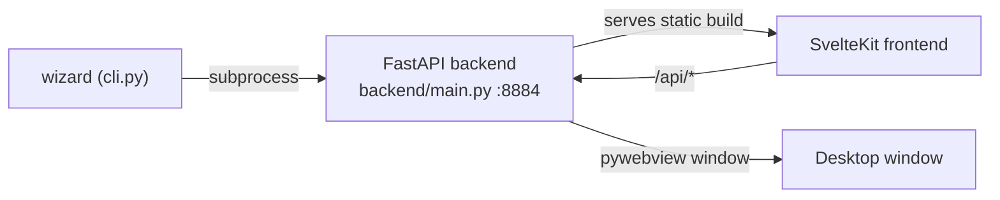

# The wizard GUI

The wizard is a local desktop app that edits the [config tree](../concepts/config-and-discovery.md)
and generates measurement projects. It is the friendly front door to everything
the library can do — but it only ever writes YAML and generates Python you can
read.

## How it runs

- [`cli.py`](../../lab_wizard/wizard/cli.py) is the `wizard` console script. It
  sets `LAB_WIZARD_PROJECTS_DIR` and launches the backend as a subprocess.
- [`backend/main.py`](../../lab_wizard/wizard/backend/main.py) is a FastAPI app.
  It defines the `/api/*` routes and then mounts the pre-built SvelteKit static
  site at `/`. A `pywebview` window points at `http://localhost:8884/`.
- The frontend ([`wizard/frontend`](../../lab_wizard/wizard/frontend/)) is built
  with Bun + Vite during `setup.sh`; the backend serves the static output.
- On startup the backend pre-warms the instrument-metadata cache in a thread so
  the first page load is instant.

The frontend never touches the filesystem. Every action is an `/api/*` call that
delegates to a backend function in `wizard/backend` or `lib/utilities`.

## Page map

The home page ([`+page.svelte`](../../lab_wizard/wizard/frontend/src/routes/+page.svelte))
groups pages by [workstation role](../concepts/architecture.md#the-three-workstation-roles):

| Page | Route | Purpose | Docs |
|---|---|---|---|
| Create Measurement | `/get_measurements` | Pick a measurement, assign resources, generate a project | [Creating measurements](creating-measurements.md) |
| Create Custom Resource | `/create_custom_resource` | Build a reusable instrument/component project programmatically | — |
| Manage Savers | `/manage_savers` | Configure savers (DB) used by measurements | [Savers & plotters](savers-and-plotters.md) |
| Manage Plotters | `/manage_plotters` | Configure plotters | [Savers & plotters](savers-and-plotters.md) |
| Manage Instruments | `/manage_instruments` | Add/reset/remove/discover local hardware | [Managing instruments](managing-instruments.md) |
| Server & Permissions | `/manage_permissions` | Start/stop the server, author safety rules | [Permissions](../remote/permissions.md), [Operations](../remote/operations.md) |
| Remote Servers | `/manage_remote_servers` | Register remote servers to consume | [Operations](../remote/operations.md) |

## API surface

All endpoints are declared in [`backend/main.py`](../../lab_wizard/wizard/backend/main.py).
The most important:

| Endpoint | Backend function | Notes |
|---|---|---|
| `GET /api/manage-instruments` | `get_configured_tree` + `get_instrument_metadata` | tree + per-type metadata |
| `POST /api/manage-instruments/add` | `add_instrument_chain` | leaf-first parent chain |
| `POST /api/manage-instruments/discover` | `DiscoveryAction.run` | [hardware probing](../concepts/config-and-discovery.md#hardware-discovery) |
| `GET /api/get-measurements` | `get_measurements` | available measurement templates |
| `GET /api/get-resources/{name}` | `reqs_from_measurement` + matching | required resources + candidates |
| `POST /api/create-measurement-project` | `generate_measurement_project` | writes the project folder |
| `GET/PUT /api/permissions` | `permissions_api` | rule vocabulary + the `permissions:` block |
| `*/api/server/*` | `server_control` | server lifecycle (start/stop/restart/bind) |
| `*/api/remote-servers*` | `remote_servers` | the remote address book |
| `GET/POST/... /api/manage-{savers,plotters}` | `flat_resource_io` | generated CRUD endpoints |
