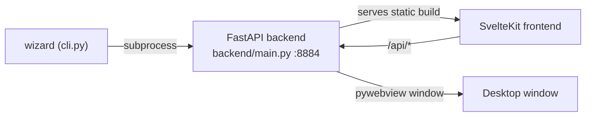
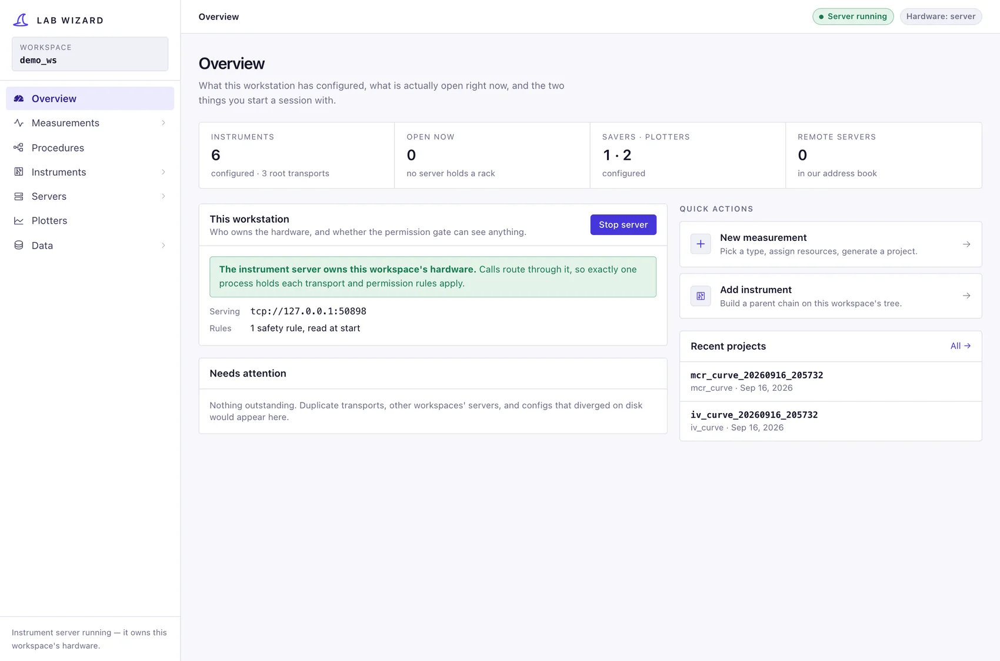

# The wizard GUI

The wizard is a local desktop app that edits the [config tree](../concepts/config-and-discovery.md)
and generates measurement projects. It is the friendly front door to everything
the library can do — but it only ever writes YAML and generates Python you can
read.

## How it runs

```mermaid
graph LR
    CLI["wizard (cli.py)"] -->|subprocess| BE["FastAPI backend<br/>backend/main.py :8884"]
    BE -->|serves static build| FE["SvelteKit frontend"]
    BE -->|pywebview window| WIN["Desktop window"]
    FE -->|/api/*| BE
```

- [`cli.py`](../../lab_wizard/wizard/cli.py) implements `wizard init` and the
  bare `wizard` launcher. The launcher resolves `lab-wizard.toml`, passes the
  workspace root to the backend, and launches it as a subprocess.
- [`backend/main.py`](../../lab_wizard/wizard/backend/main.py) is a FastAPI app.
  It includes the `/api/*` routers from `backend/routes/` and then mounts the pre-built SvelteKit static
  site at `/`. A `pywebview` window points at `http://localhost:8884/`.
- The frontend ([`wizard/frontend`](../../lab_wizard/wizard/frontend/)) is built
  with Bun + Vite during `setup.sh`; the backend serves the static output.
- On startup the backend pre-warms the instrument-metadata cache in a thread so
  the first page load is instant.

## The sections

The left rail has seven sections, each a noun rather than a task. These docs
mirror them.

| Section | Route | What it is for | Page |
|---|---|---|---|
| Overview | `/` | what this workstation is doing right now: server state, hardware owner, recent projects | — |
| Measurements | `/measurements/new`, `/measurements/projects` | pick something to run, bind instruments to it, generate a project; then list what has been generated | [Measurements](measurements.md) |
| Procedures | `/procedures` | write and edit procedures — roles, parameters, step tree | [Procedures](procedures.md) |
| Instruments | `/instruments`, `/instruments/custom` | configure the hardware this workspace owns; build standalone resource files | [Instruments](instruments.md) |
| Servers | `/servers`, `/servers/permissions`, `/servers/hardware`, `/servers/remote` | run a server, author safety rules, see who holds what, register servers elsewhere | [Servers](servers.md) |
| Data | `/data` | browse and plot what runs recorded | [Data](data.md) |
| Settings | `/settings` | what applies to every project: how runs are saved as files; where the workspace keeps things | [Saving files](data.md#saving-files) |

## API surface

Endpoints are declared in
[`backend/routes/`](../../lab_wizard/wizard/backend/routes/), one module per
section of the GUI (`measurements`, `runs`, `procedures`, `instruments`,
`servers`, `data`, `live`, `settings`); [`backend/main.py`](../../lab_wizard/wizard/backend/main.py)
builds the app and opens the window. The ones worth knowing:

| Endpoint | Does |
|---|---|
| `GET /api/manage-instruments` | the configured tree plus per-type metadata |
| `POST /api/manage-instruments/add` | add an instrument, parent chain and all |
| `POST /api/manage-instruments/discover` | [probe hardware](../concepts/config-and-discovery.md#hardware-discovery) |
| `GET /api/instrument-sources` | every place an instrument can come from — this workspace, its own server, other machines, remote servers — with the claims each holds |
| `GET /api/measurement-choices` | every procedure a measurement can be created from |
| `GET /api/get-resources/{name}?kind=` | what a measurement or procedure requires, and what could fill it |
| `POST /api/create-measurement-project` | write the project folder |
| `GET /api/procedures`, `GET/PUT/DELETE /api/procedures/{name}` | the procedure library |
| `GET /api/procedures/catalog` | step types, behaviors, and which instruments could fill each |
| `POST /api/procedures/check` | every problem with a definition being edited, each with the step it is about, plus the Python it generates |
| `GET/PUT/DELETE /api/procedures/{name}/presets/...` | parameter presets |
| `GET/PUT /api/permissions` | the rule vocabulary and the `permissions:` block |
| `/api/server/*` | server lifecycle (start, stop, restart, bind) |
| `GET /api/local-servers/claims`, `POST .../force-release` | run claims on this machine's servers |
| `/api/remote-servers*` | the address book |
| `GET/PUT /api/projects/{name}/settings` | a project's run details, params and outputs, as fields or YAML; a refusal lists every problem with its path |
| `GET/POST /api/projects/{name}/launch`, `POST .../stop` | run a project as its own process, follow it, Ctrl-C it |
| `WS /api/live/runs/{id}` | a run as it happens — status, steps, every plot — read from the lab database |
| `GET /api/settings/workspace` | where the workspace keeps config, projects, runs and logs |
| `GET/PUT /api/settings/files` | how runs are saved as files, for the whole workspace |
| `POST /api/settings/files/check` | what a folder template would name the latest run, and what is wrong with it |

## What the frontend may and may not do

The frontend never touches the filesystem. Every action is an `/api/*` call that
delegates to `wizard/backend` or `lib/`. That is what keeps the GUI and a
hand-driven workflow honest about editing the same YAML.
