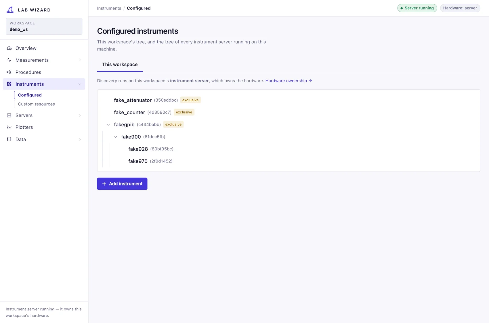
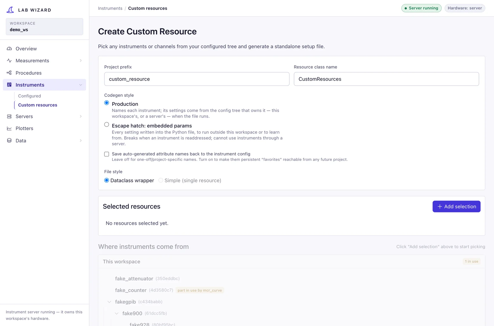

# Instruments

**Instruments → Configured** (`/instruments`) is the editor for the hardware
this workstation drives — the **host** role. It reads and writes
`config/instruments/`.

A tab row across the top selects whose tree you are editing: this workspace, or
another workspace's server **on this machine**, whose config it can edit through
that server. Servers on *other* machines deliberately get no tab — a remote peer
may read and call their instruments but never reconfigure them, so they appear
as a flat list of named leaves where you bind instruments, not here. Register
those under [Servers → Remote servers](servers.md#remote-servers).

## What the page shows

`GET /api/manage-instruments` returns:

- **`tree`** — the configured instrument tree (`get_configured_tree`), a list of
  top-level instruments each with nested `children`, each node carrying its
  `type`, `key` (hash), `fields`, and a node-only `yaml` preview.
- **`metadata`** — for every discoverable instrument type
  ([`get_instrument_metadata`](../concepts/config-and-discovery.md#type-discovery)):
  defaults, `key_hint`, parent chain, child types, discovery-action specs,
  `params_schema` (Pydantic JSON Schema), and `read_only_fields`.

The metadata drives the "add instrument" UI: it knows which types are top-level
vs children, what each type's parent chain is, and what default field values to
seed a new node with.

## Adding an instrument

Use **Add** beside a controller or mainframe (or **Add child** in its inspector)
to add a compatible module. The picker only offers its direct child types and
preselects the entire existing ancestor chain. **Add instrument** in the tree
header still supports creating a new controller or building a complete chain.

Because a child may need parents that don't exist yet, the GUI builds a
leaf-first **chain** in a backend draft. Each step is
either:

- `use_existing` — reuse a node already in the config, or
- `create_new` — create it from defaults (plus any `extra` field overrides).

The wizard stages the chain with `PUT /api/manage-instruments/drafts/{id}`.
Staging and canceling write no instrument YAML. Drafts expire after an hour of
inactivity; closing the wizard deletes its draft. The final
`POST /api/manage-instruments/drafts/{id}/commit` validates against the current
configuration and saves the complete chain, including discovered children. A
repeated commit returns the original result while that draft remains available.

The underlying `add_instrument_chain` operation also serves the direct `/add`
endpoint and server RPC. It rejects duplicate addresses instead of replacing
existing parameters or children. Config edits retain disabled roots and children,
although those instruments remain excluded from the runtime tree.

The chain is processed root-first; the raw key value you supply (port, slot,
GPIB address) is written into the params and the node is stored under its
[derived hash](../concepts/config-and-discovery.md#hashing).

The `key_hint` on each type tells you what the key means, e.g. *"USB port (e.g.
/dev/ttyUSB0)"*, *"Slot number (e.g. 1)"*, *"GPIB address (e.g. 4)"*.

## Discovering hardware

Instead of typing addresses, you can **probe** for connected hardware if the
instrument's `Params` class is `Discoverable`. `POST /api/manage-instruments/discover`
runs the chosen [discovery action](../concepts/config-and-discovery.md#hardware-discovery).
Depending on the result type the GUI will:

- list serial-port candidates for you to pick (`ProbeResult`),
- list instances found on a bus for you to pick (`SelfCandidatesResult`), or
- include discovered sub-modules (`ChildrenResult`) in the final draft commit.

`POST /api/manage-instruments/apply-children` also supports scanning an existing
parent. It takes the exact root-first parent path, preserves already-configured
children, and uses the server's held/claimed-rack guards, registry reload, and audit.

If a child's discovery action needs a live parent (e.g. scan a GPIB bus through
the Prologix controller), the backend walks and initializes the resolved parent
chain first, then releases the root transport when done. Unsaved parents are
instantiated from the draft in memory, through the owning server when available.
The wizard waits for a scan or save to finish before allowing dismissal.

## Editing, resetting, removing

Select a row to open its right-hand inspector. The tree can be searched by name,
type, address, or hash; matching children keep their ancestors visible. On a
narrow screen the inspector appears below the tree.

The **Parameters** tab renders typed inputs from the owning server's Python
parameter schema, including collapsible channel settings, descriptions, and
nullable values. Changes stay in a draft until **Save changes**; **Discard**
restores the saved values. Switching instruments or workspaces asks before
abandoning a draft. Use **Reload saved instruments** in the tree header after a
conflict with another editor.

**Saved YAML** is a read-only, normalized preview of the selected instrument's
saved parameters. It uses the same field order and description comments as the
Python YAML writer; children have separate previews. It does not include an
unsaved form draft. Type, address, and availability fields are read-only in the
inspector; address changes require adding an instrument at its new address.

The update endpoint accepts a root-first `path`, `fields`, and `expected_fields`.
It validates through the actual Params class, rejects unknown fields and
duplicate attribute names, and compares the saved values before writing to
prevent stale drafts overwriting another editor. Only the selected YAML file is
written, preserving child references (including disabled children). The same
`tree_update` RPC serves this workspace and other local-server tabs: held or
claimed hardware refuses edits, successful writes reload the registry and record
an audit event. These are saved configuration changes, not live hardware commands.

| Action | Endpoint | Effect |
|---|---|---|
| Save parameters | `POST /api/manage-instruments/update` | Validate and save the selected node, preserving its identity and children |
| Reset | `POST /api/manage-instruments/reset` | `reinitialize_instrument` — restore default field values, **preserve children** and the key field (so the hash is stable) |
| Remove | `POST /api/manage-instruments/remove` | `remove_instrument` — delete the node and clean up orphaned files/empty folders |

Reset and remove requests also carry the selected ancestor path, so identical
slot hashes under different racks target the correct instrument.

## `attribute_name` — the stable handle

Leaf instruments (and individual channels) can carry an `attribute_name` — a
human-given identifier like `cryo_amp_bias_source`. This is the durable handle
used by:

- **remote `from_attribute`** project generation (the generated setup asks the
  server for the instrument by this name),
- the **permission gate** (rules reference instruments by `attribute_name`), and
- the **instrument server** (it exposes every named instrument).

Unlike the hash key, `attribute_name` is stored and never derived, so it survives
edits to slot/port. Set semantically meaningful names for anything you intend to
reference remotely or in a safety rule.

## Custom resources

**Instruments → Custom resources** (`/instruments/custom`) generates a
standalone Python file that opens instruments you pick — no measurement, no
procedure, no run. It is for a notebook, a calibration script, or poking at a
rack by hand.

Pick any instruments or channels — from this workspace or through a server —
give each a variable name, and the generator writes either a dataclass holding
all of them or a single returned object.

The two styles are the same two [measurement generation](measurements.md#generation-styles)
offers, for the same reasons:

| Style | What it writes |
|---|---|
| **Production** | names each instrument and resolves it against the config tree that owns it — this workspace's, or a server's — when the file runs |
| **Escape hatch: embedded params** | every setting written into the Python, so the file runs outside any workspace. Breaks when an instrument is readdressed, and cannot use instruments through a server |

Instruments a run is currently holding are marked **in use** here as well, so a
resource file for a busy rack is a visible choice rather than a surprise.

An instrument with no `attribute_name` gets one generated. Tick **save
auto-generated attribute names** to write those back into the config tree,
making them permanent handles any future project can use.
