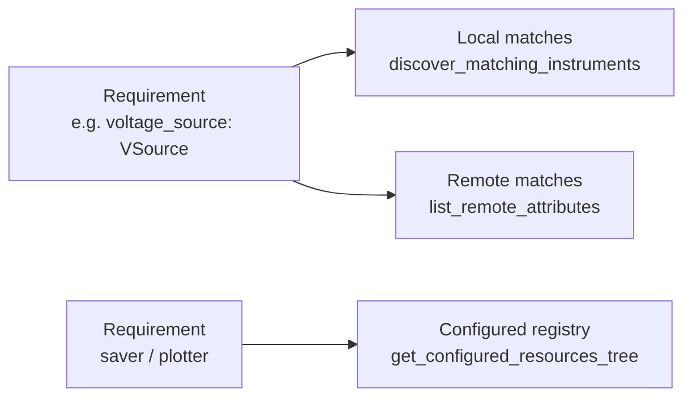

# Measurements

The **Measurements** section is the core wizard workflow: pick something to run
(`/measurements/new`), bind each resource it needs to a configured instrument,
saver and plotter (`/measurements/resources`), and generate a runnable project
folder. `/measurements/projects` lists what has been generated.

What you pick from is both kinds of measurement side by side: hand-written
Python under `lib/measurements/`, and [procedures](procedures.md) — this
workspace's own and the ones built into lab_wizard. To the person binding
instruments they are the same thing: roles to fill and parameters to set.

This page explains how the matching and code generation work.

## How a measurement declares what it needs

A measurement lives in `lib/measurements/<name>/` and has two files:

- `<name>.py` — the measurement class (the run logic), and
- `<name>_setup_template.py` — a template the wizard fills in.

The template defines a `@dataclass` ending in `Resources` whose **annotations**
declare the required resources. From
[`iv_curve_setup_template.py`](../../lab_wizard/lib/measurements/iv_curve/iv_curve_setup_template.py):

```python
@dataclass
class IVCurveResources:
    # wizard:resource_fields:start
    savers: list[GenericSaver] = field(default_factory=list)
    plotters: list[GenericPlotter] = field(default_factory=list)
    voltage_source: VSource = field(default_factory=StandInVSource)
    voltage_sense: VSense = field(default_factory=StandInVSense)
    # wizard:resource_fields:end
    params: IVCurveParams = field(default_factory=IVCurveParams)
```

[`get_measurements.py`](../../lab_wizard/wizard/backend/get_measurements.py)
reads these annotations and classifies each field:

- a field typed as a subclass of `GenericSaver` → a **saver** requirement,
- a subclass of `GenericPlotter` → a **plotter** requirement,
- anything else (a behavior ABC like `VSource`) → an **instrument** requirement.

`list[T]` annotations are recognized (e.g. `savers: list[GenericSaver]`), and
`params` is skipped.

## Matching resources to requirements

`GET /api/get-resources/{name}` returns, for each requirement, the candidates the
user can pick from:



- **Instruments** are matched by **class hierarchy**:
  [`discover_matching_instruments`](../../lab_wizard/wizard/backend/get_measurements.py)
  imports every class under `lib/instruments` and keeps the ones that are a
  subclass of the required behavior ABC. So a `VSource` requirement offers
  `Sim928`, `Dac4DChannel`, etc. — and crucially, it offers the **configured
  instances** of those from your tree.
- **Remote instruments** matching the requirement's behavior ABC are pulled from
  registered [remote servers](../remote/operations.md) and offered alongside
  local ones (matched by `behavior_abc` name).
- **Savers/plotters** are offered from their flat config registries — you pick a
  configured instance by name.

This is the answer to *"how are instruments chosen for measurements based on
generic instruments?"*: the measurement asks for a **behavior** (the generic ABC),
and the wizard offers every configured instrument that **is-a** that behavior.

## Generating the project

`POST /api/create-measurement-project` (→
[`generate_measurement_project`](../../lab_wizard/wizard/backend/project_generation.py))
does three things:

1. **Writes a project YAML** containing only the *subset* of config you selected
   — the chosen instrument lineages (leaf back to root), savers, and plotters —
   plus a `device` block and measurement defaults. This is a self-contained
   snapshot, so the project keeps working even if the central config changes.
2. **Fills in the setup template** by replacing the `# wizard:<block>:start/end`
   regions:
   - `imports` — concrete instrument/saver/plotter imports,
   - `resource_fields` — the dataclass field declarations,
   - `instantiation` — the construction lines,
   - `return_fields` — wiring the constructed objects into the `Resources`.
3. **Copies the measurement source** (`<name>.py`) into the project. The
   generated setup imports this sibling module, so edits made inside the project
   are the code that runs.

The project folder is timestamped, e.g. `projects/iv_curve_20260528_143012/`,
containing `<folder>.yaml`, `<name>_setup.py`, and `<name>.py`.

### What a project contains

A project names its instruments and copies none of their settings. Its YAML
records each instrument's `attribute_name` and where it lives:

```yaml
resources:
  instrument_sources:
    sim928-brave-otter: local          # this workspace's config/instruments
    counter-quiet-lynx: cryo-rack      # a server in config/remote/servers.yaml
```

and the setup file resolves each one when the project runs:

```python
voltage_source_1 = resources.from_attribute("sim928-brave-otter")
```

So a rack readdressed, or a bench setting changed, in Manage Instruments reaches
every project that uses it without regenerating. The measurement's own params
(`measurement.params`) stay frozen in the project. A project must run from inside
its workspace, and says so if it is not. Removing an instrument in Manage
Instruments lists the projects that use it first.

Each instrument can come from this workspace directly, or **through this
workspace's server** — the same instruments, used through the process that owns
them instead of opened by the project. When a local selection conflicts with a
rack the server holds, the warning offers that switch.

### Generation styles

| Style | What it writes | When to use |
|---|---|---|
| `production` (default) | instruments by name, as above | always, unless you need the escape hatch |
| `pedagogical_embedded` | every instrument's params written into the Python, plus a full copy in the project YAML | running a project outside any workspace, or reading how instruments are built. Breaks when an instrument is readdressed; cannot use an instrument through a server |

The former YAML-expanded teaching style is retired. Projects generated before
this change carry their own instrument copy and keep running exactly as they did.

**Custom resources** (Instruments → Custom resources) follow the same two
styles, for the same reasons: a production file names its instruments and
resolves them against the tree that owns them, and the embedded one carries its
own copy.

### Instruments a run is holding

An instrument a running measurement has claimed is marked **in use** in the
picker, with who holds it; a claim on part of an instrument — one input of a
counter — reads *part in use*. Binding one is still allowed, because the run may
well be over before this project is run; what cannot happen is the two holding
it at once. See [run claims](../remote/operations.md).

### Procedures and presets

Measurements under `lib/measurements` and [procedures](../concepts/procedures.md)
are offered side by side, and either can start from a named **params preset**
from `config/measurements/<name>/`, copied into the project when it is generated.

## Running the generated project

```bash
cd projects/iv_curve_20260528_143012
uv run iv_curve_setup.py             # local: loads the project YAML
uv run iv_curve_setup.py --remote tcp://lab-server:12300   # remote
```

The template's `__main__` block picks local resources, a per-attribute
`CompositeResources`, or the all-remote override, then hands the run to
[`RunLifecycle`](../../lab_wizard/lib/task_adapters/lifecycle.py). The same
procedure works in each mode because measurements consume behavior ABCs, which
both local instruments and [remote proxies](../remote/architecture.md) satisfy.
Observations flow through the procedure data bus to the configured saver and
plotter adapters.

Every run goes through the same steps, in this order:

1. **Claim.** Every exclusive transport this process will open is leased for
   the length of the run, and every instrument server on the machine is asked
   whether it already holds one. Either refusal stops the run with the holder's
   name, before any instrument is opened.
2. **Resolve, then claim what is routed.** The instruments are constructed —
   only now, because opening a serial-backed rack before claiming it is the race
   claims exist to close. Instruments that live on a server are then claimed
   *there*, so two runs cannot drive the same remote instrument at once. Those
   claims are renewed for the length of the run and released at the end; see
   [run claims](../remote/operations.md#several-runs-on-one-server-claims).
3. **Baseline.** `apply_baseline()` writes each bound instrument's configured
   bench settings (coupling, impedance, wavelength, …), so a setting an earlier
   experiment changed cannot carry into this one.
4. **Run** the measurement.
5. **Safe state, if the run failed.** On a failure, an abort, an exception or
   Ctrl-C, each instrument that declares a safe state is put in it — a source to
   0 V and off, an attenuator shutter-closed at maximum attenuation. A run that
   completes is left where its own procedure ended it, so a choice like the IV
   curve's `turn_off_at_end: false` is honoured.
6. **Release** the claims, always.

The script exits non-zero when the run does not succeed.

## The projects list

`/measurements/projects` lists every project this workspace has generated,
newest first: what it measures, what it is bound to, and when it was made.

The wizard does not run them — there is no launch button yet (see the
[Roadmap](../roadmap.md#running-measurements)). A project is a folder you run
from a terminal, which is also what makes it inspectable and editable.
