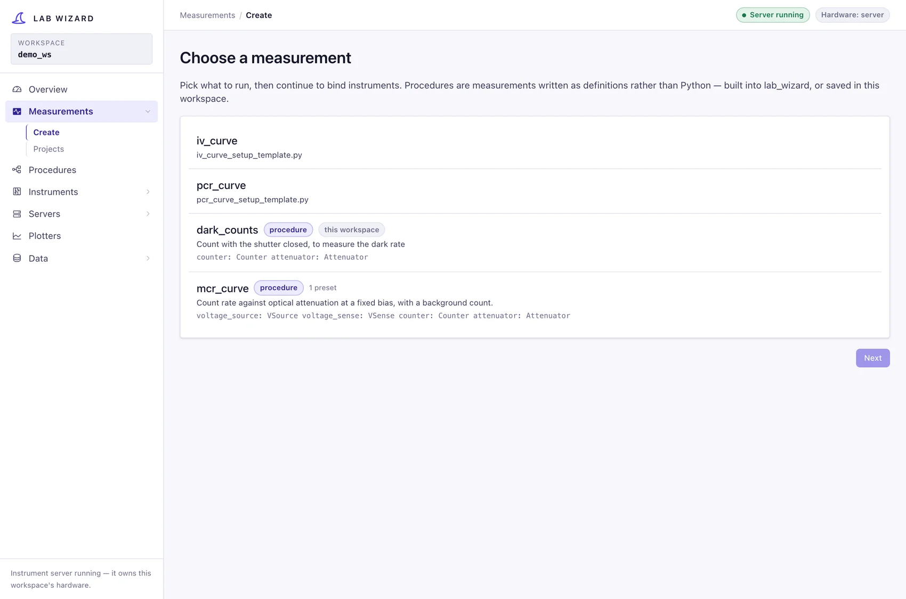
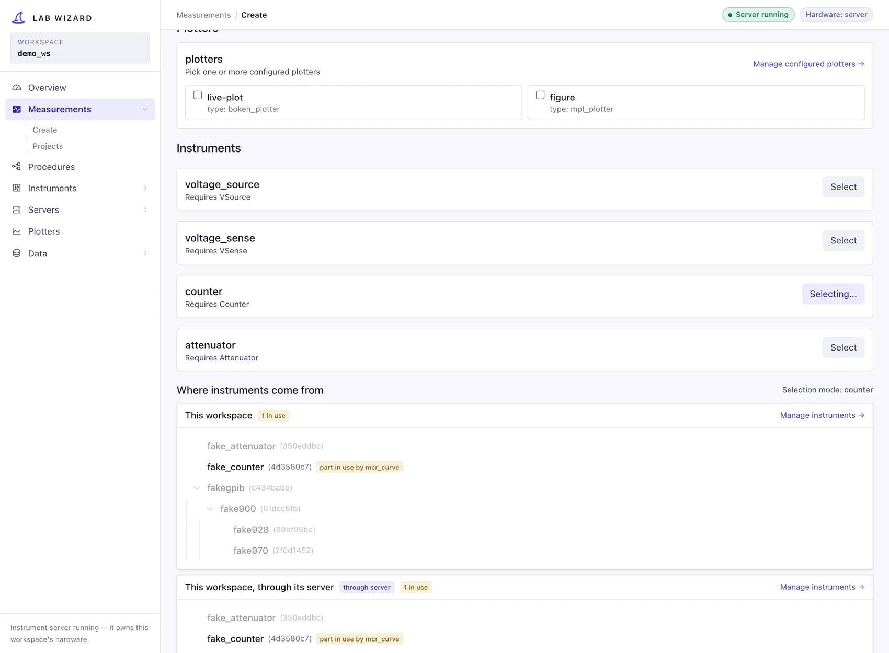
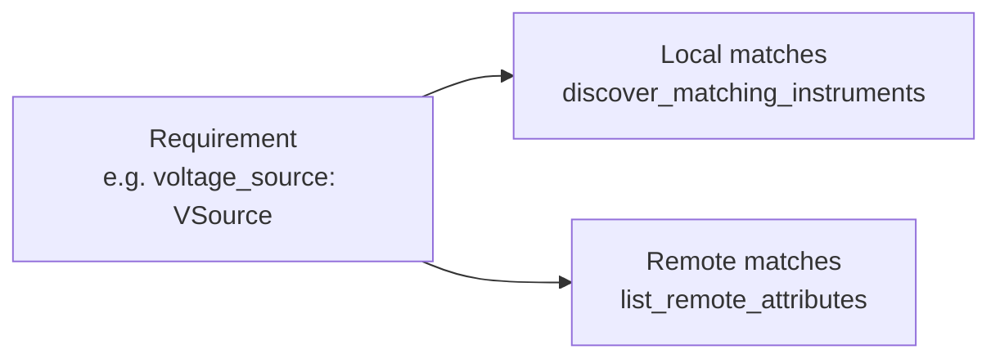
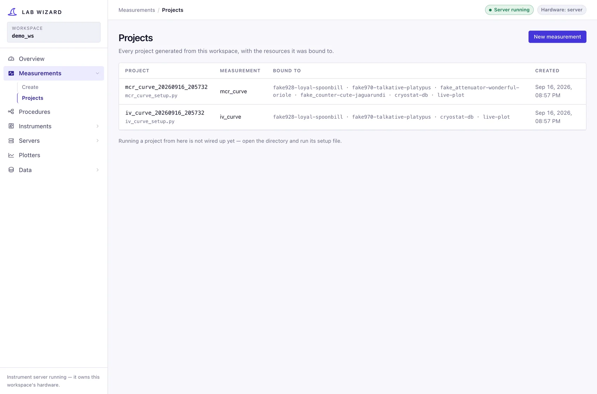

# Measurements

The **Measurements** section is the core wizard workflow: pick something to run
(`/measurements/new`), bind each role it needs to a configured instrument and
choose what its runs produce (`/measurements/resources`), and generate a
runnable project folder. `/measurements/projects` lists what has been
generated, and `/measurements/run` sets a project up, runs it, and shows it
live ([The Run page](#the-run-page)).

What you pick from is a list of [procedures](procedures.md) — the ones built
into lab_wizard (`iv_curve`, `pcr_curve`, `mcr_curve`) and this workspace's own
— and this workspace's [custom measurements](#custom-measurements). Each has
roles to fill and parameters to set.

This page explains how the matching and code generation work.



## How a measurement declares what it needs

A procedure declares its **roles**, each with the behavior it needs
(`voltage_source: {behavior: VSource}`); every role is an instrument
requirement.

A custom measurement declares them as the fields of its `Resources`
dataclass, typed by behavior (`voltage_source: VSource`); `list[T]` fields are
recognized, and `params` is not a role.

## Custom measurements

For what a composed procedure cannot say — a search that decides where to
measure next, a loop that stops on a condition — a measurement can be written
in Python. It is one file in the workspace's `measurements/` folder, and the
wizard offers it beside the procedures (marked *custom*). A new workspace
starts with two examples there, which are also the documentation:

- **`bias_sweep.py`** — the smallest complete one, built from existing steps.
- **`find_switching_voltage.py`** — written as `measure(resources, run)`, a
  plain Python loop: it raises the bias until the detector switches, then
  stops.

A file declares:

| Name | Is |
|---|---|
| `Params` | a pydantic model of its settings, every field with a default. They become the project's `measurement.params` |
| `Resources` | a dataclass: one field per instrument role, typed by the behavior it needs, and a `params` field |
| `measure(resources, run)` *or* `build_procedure(resources)` | what one run does: plain Python recording rows through `run`, or a step tree |
| `PLOTS` (optional) | plot specs, as a procedure's `plots:` — what the Data page and the live views draw |

Its first docstring line is its description in the wizard. A file whose name
starts with `_` is a helper, not a measurement, and a file that does not load
is listed with the reason.

In `measure`, `run` records the data ([`recording.py`](../../lab_wizard/lib/recording.py)):

```python
for bias in biases:
    source.set_voltage(bias)
    run.sleep(settle_s)                      # stops promptly when the run is stopped
    with run.at(bias_voltage=bias):          # the parameters these rows were taken at
        run.row(sense_voltage=sense.get_voltage())   # one call, one row
```

The same calls work in a script or a notebook, outside any project, with
`with record_run("quick_iv", device="A7") as run:`; the run is recorded in the
workspace's lab database like any other. From there a custom measurement is
like any other: its project copies the file, and every run is recorded, saved
and plotted the same way. See
[`custom_measurements.py`](../../lab_wizard/lib/custom_measurements.py).

## Matching resources to requirements



`GET /api/get-resources/{name}` returns, for each requirement, the candidates the
user can pick from:



- **Instruments** are matched by **class hierarchy**:
  [`discover_matching_instruments`](../../lab_wizard/wizard/backend/get_measurements.py)
  imports every class under `lib/instruments` and keeps the ones that are a
  subclass of the required behavior ABC. So a `VSource` requirement offers
  `Sim928`, `Dac4DChannel`, etc. — and crucially, it offers the **configured
  instances** of those from your tree.
- **Remote instruments** matching the requirement's behavior ABC are pulled from
  registered [remote servers](../remote/operations.md) and offered alongside
  local ones (matched by `behavior_abc` name).

This is the answer to *"how are instruments chosen for measurements based on
generic instruments?"*: the measurement asks for a **behavior** (the generic ABC),
and the wizard offers every configured instrument that **is-a** that behavior.

## Generating the project

`POST /api/create-measurement-project` (→
[`generate_measurement_project`](../../lab_wizard/wizard/backend/project_generation.py))
does three things:

1. **Writes a project YAML** containing only the *subset* of config you selected
   — the chosen instruments — plus a `run:` block, the `outputs:` chosen, and
   measurement defaults. This is a self-contained
   snapshot, so the project keeps working even if the central config changes.
2. **Fills in the setup template** by replacing the `# wizard:<block>:start/end`
   regions:
   - `imports` — concrete instrument imports (embedded style only),
   - `resource_fields` — the dataclass field declarations,
   - `instantiation` — the construction lines,
   - `return_fields` — wiring the constructed objects into the `Resources`.
3. **Copies the measurement source** into the project, as
   `_measurement/<name>.py`. The setup loads it by its path, so edits made
   inside the project are the code that runs.

The project folder is timestamped, e.g. `projects/iv_curve_20260528_143012/`,
containing `<folder>.yaml`, `<name>_setup.py`, and `_measurement/<name>.py`.
The module sits one folder down because a script's own folder comes first on
Python's import path: a measurement named `queue.py` beside the setup would be
what every `import queue` in the run found, the standard library's included.
See [`project_module.py`](../../lab_wizard/lib/project_module.py).

### What a project contains

A project names its instruments and copies none of their settings. Its YAML
records each instrument's `attribute_name` and where it lives:

```yaml
resources:
  instrument_sources:
    sim928-brave-otter: local          # this workspace's config/instruments
    counter-quiet-lynx: cryo-rack      # a server in config/remote/servers.yaml
```

and the setup file resolves each one when the project runs:

```python
voltage_source_1 = resources.from_attribute("sim928-brave-otter")
```

So a rack readdressed, or a bench setting changed, in Manage Instruments reaches
every project that uses it without regenerating. The measurement's own params
(`measurement.params`) stay frozen in the project. A project must run from inside
its workspace, and says so if it is not. Removing an instrument in Manage
Instruments lists the projects that use it first.

Each instrument can come from this workspace directly, or **through this
workspace's server** — the same instruments, used through the process that owns
them instead of opened by the project. When a local selection conflicts with a
rack the server holds, the warning offers that switch.

### Generation styles

| Style | What it writes | When to use |
|---|---|---|
| `production` (default) | instruments by name, as above | always, unless you need the escape hatch |
| `pedagogical_embedded` | every instrument's params written into the Python, plus a full copy in the project YAML | running a project outside any workspace, or reading how instruments are built. Breaks when an instrument is readdressed; cannot use an instrument through a server |

The former YAML-expanded teaching style is retired. Projects generated before
this change carry their own instrument copy and keep running exactly as they did.

**Custom resources** (Instruments → Custom resources) follow the same two
styles, for the same reasons: a production file names its instruments and
resolves them against the tree that owns them, and the embedded one carries its
own copy.

### Outputs

Every run is recorded in the lab database; that is not a choice. What else a
run produces is, and it lives in the project YAML so it can be changed without
regenerating:

```yaml
outputs:
  files: true       # also save each run as a folder of files
  live_plot: web    # web | window | none: how a run started from a terminal is drawn
  plot: ""          # which of the procedure's plots: to draw; empty for the first
```

- **`files`** is on by default. Where the folders go and how they are named is
  the workspace's choice, under Settings → [Saving files](data.md#saving-files).
- **`live_plot`** only matters for a run started from a terminal; a project
  created in the wizard starts with `web`. `window`
  opens a matplotlib window at the lab computer; `web` opens the live plot page
  in a window, or, over SSH, prints a link and the tunnel command that reaches
  it. That page shows the plots and the run's timeline, not the wizard. Both
  run in processes of their own and read the run from the lab database as it
  records, so closing one never stops the run. A run started from the
  wizard is drawn on the [Run page](#the-run-page) instead.

### Instruments a run is holding

An instrument a running measurement has claimed is marked **in use** in the
picker, with who holds it; a claim on part of an instrument — one input of a
counter — reads *part in use*. Binding one is still allowed, because the run may
well be over before this project is run; what cannot happen is the two holding
it at once. See [run claims](../remote/operations.md).

### Procedures and presets

A [procedure](../concepts/procedures.md) can start from a named **params
preset** from `config/measurements/<name>/`, copied into the project when it is
generated.

## Running the generated project

```bash
cd projects/iv_curve_20260528_143012
uv run iv_curve_setup.py             # local: loads the project YAML
uv run iv_curve_setup.py --remote tcp://lab-server:12300   # remote
```

The template's `__main__` block picks local resources, a per-attribute
`CompositeResources`, or the all-remote override, then hands the run to
[`RunLifecycle`](../../lab_wizard/lib/task_adapters/lifecycle.py). The same
procedure works in each mode because measurements consume behavior ABCs, which
both local instruments and [remote proxies](../remote/architecture.md) satisfy.
Rows flow through the procedure data bus to the lab database and to whatever
the project's [`outputs:`](#outputs) asks for.

### Every run is recorded

A run started from a project is recorded in the workspace's lab database,
`data/lab.db`: the run itself, one row per point, every step it executed, what
each instrument was configured with, and the procedure definition it ran. A
project outside any workspace records into its own `data/lab.db` instead. The
database does not need to be configured or selected.

What the run is *about* comes from the project YAML's `run:` block, read at the
start of every run, so edit it when you swap devices:

```yaml
run:
  device: A7                        # the device under test, by name
  operator: andrew
  notes: first cooldown after rewiring
  metadata: {cryostat: BlueFors1}   # anything else worth filtering runs by
```

A device named here for the first time is added to the database. Everything in
the block becomes something the Data page will be able to filter runs by.

Every run goes through the same steps, in this order:

1. **Claim.** Every exclusive transport this process will open is leased for
   the length of the run, and every instrument server on the machine is asked
   whether it already holds one. Either refusal stops the run with the holder's
   name, before any instrument is opened.
2. **Resolve, then claim what is routed.** The instruments are constructed —
   only now, because opening a serial-backed rack before claiming it is the race
   claims exist to close. Instruments that live on a server are then claimed
   *there*, so two runs cannot drive the same remote instrument at once. Those
   claims are renewed for the length of the run and released at the end; see
   [run claims](../remote/operations.md#several-runs-on-one-server-claims).
3. **Baseline.** `apply_baseline()` writes each bound instrument's configured
   bench settings (coupling, impedance, wavelength, …), so a setting an earlier
   experiment changed cannot carry into this one.
4. **Run** the measurement.
5. **Safe state, if the run failed.** On a failure, an abort, an exception or
   Ctrl-C, each instrument that declares a safe state is put in it — a source to
   0 V and off, an attenuator shutter-closed at maximum attenuation. A run that
   completes is left where its own procedure ended it, so a choice like the IV
   curve's `turn_off_at_end: false` is honoured.
6. **Release** the claims, always.

The script exits non-zero when the run does not succeed.

## The projects list

`/measurements/projects` lists every project this workspace has generated,
newest first: what it measures, what it is bound to, what its runs produce, and
when it was made.



A project's name opens it on the Run page. A project is also a folder you can
run from a terminal, which is what makes it inspectable and editable.

## The Run page

`/measurements/run?project=<name>` is one page for the loop of running a
measurement: change something, run, look, change it again.

**Left, what the next run will be**, as fields or as the project's YAML (the
same file; switching saves). Everything here is read by the run when it
starts, so nothing is regenerated:

- **This run** — the device under test, operator and notes. Devices and
  operators this lab has used are suggested.
- **Metadata** — fields and groups of fields, anything worth finding the run by
  later. Each becomes a Data page filter: `cryostat` is `run.cryostat`, a field
  `fiber` in a group `optics` is `run.optics.fiber`. Names and values already
  recorded are suggested, so the same thing keeps the same name. A number stays
  a number, so it can be filtered by range.
- **Parameters** — a form built from the measurement's params model: numbers
  are checked as they are typed, and a sweep's mode switches its fields.
- **Outputs** — files, and the live plot for runs started from a terminal.

Save checks the whole file against the project's model; a problem is shown at
the field it is about, and nothing is written until there is none.

**Run** (or *Save and run*) starts the project's setup file as its own process,
exactly as a terminal would — same claims, same lifecycle, same record — so
the run survives the wizard closing. **Stop** is a Ctrl-C: the run aborts
through its own guards and the instruments are put in their safe state.

**Right, the run**: its status, a tab for each of its plots, and its timeline,
all live. The timeline follows the newest step, and **Now** above it names the
branch of the procedure the run is in (`source_guard › sweep[0] ›
sequence#17 › wait[1]`). When nothing is running it shows the project's last
run. If the run fails before it records anything, the output of its process is
shown underneath.

The live view reads the run from the lab database as it is recorded — every
point and every step is committed as it happens — and the wizard pushes the
changes to the page over a websocket. So the page can be opened, closed and
reopened mid-run, and the standalone live page a web plotter opens is the same
view.
