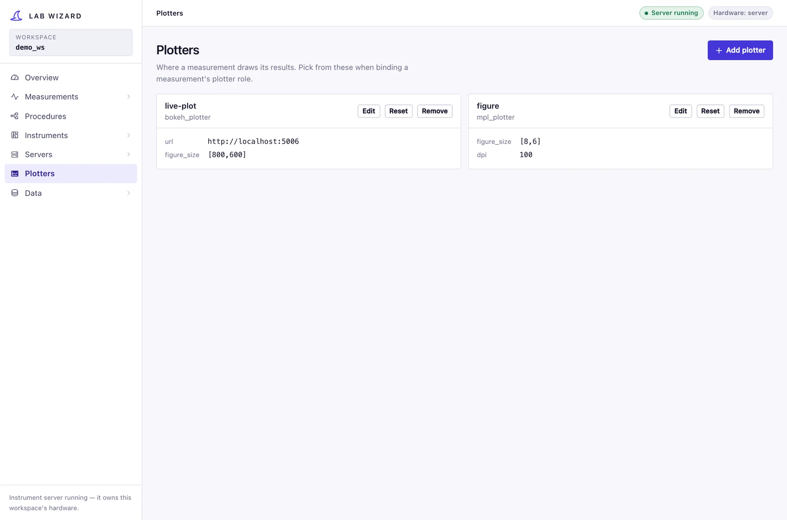

# Plotters

The **Plotters** section configures how a run's data is drawn while it runs. A
plotter is a [flat resource](../concepts/config-and-discovery.md#flat-resources):
no hardware addressing, no hierarchy, one YAML file per configured instance in
`config/plotters/`.

!!! warning "Plotters are scaffolding today"
    Both shipped plotters are **placeholders**: they record the last payload and
    print it. Nothing renders yet. You can configure them and bind them to a
    measurement — the wiring is real and tested — but no window opens and no
    figure is written. See the [Roadmap](../roadmap.md).

## What exists

| Type | Class | Status |
|---|---|---|
| `mpl_plotter` | [`MplPlotter`](../../lab_wizard/lib/plotters/mpl_plotter.py) | placeholder — stores the last payload, prints |
| `bokeh_plotter` | [`BokehPlotter`](../../lab_wizard/lib/plotters/bokeh_plotter.py) | placeholder — same |
| — | `StandInPlotter` | deliberate no-op, for tests and scaffolding |

## How a plotter receives data

A run publishes every observation on its data bus.
[`PlotterSink`](../../lab_wizard/lib/task_adapters/plotters.py) forwards each
one's `data` dict to every bound plotter's `plot()` — the same stream the savers
receive, so a plotter and the database never disagree about what happened.

Because each observation is one flat row — the swept values in force alongside
the readings — "plot count rate against bias" is a choice of two column names,
not a traversal of the run's loop structure. The columns a procedure produces
are listed in its [composer](procedures.md), which is what a future axis picker
would offer.

## Writing a real one

`GenericPlotter` ([`plotters/plotter.py`](../../lab_wizard/lib/plotters/plotter.py))
declares `plot(data)` and `save_plot(...)`. A working plotter is those two
bodies: drop a `PlotterParams` subclass with a `type: Literal[...]` into
`lib/plotters/` and it is
[discovered](../concepts/config-and-discovery.md#type-discovery) and offered by
the GUI with no registration step.
