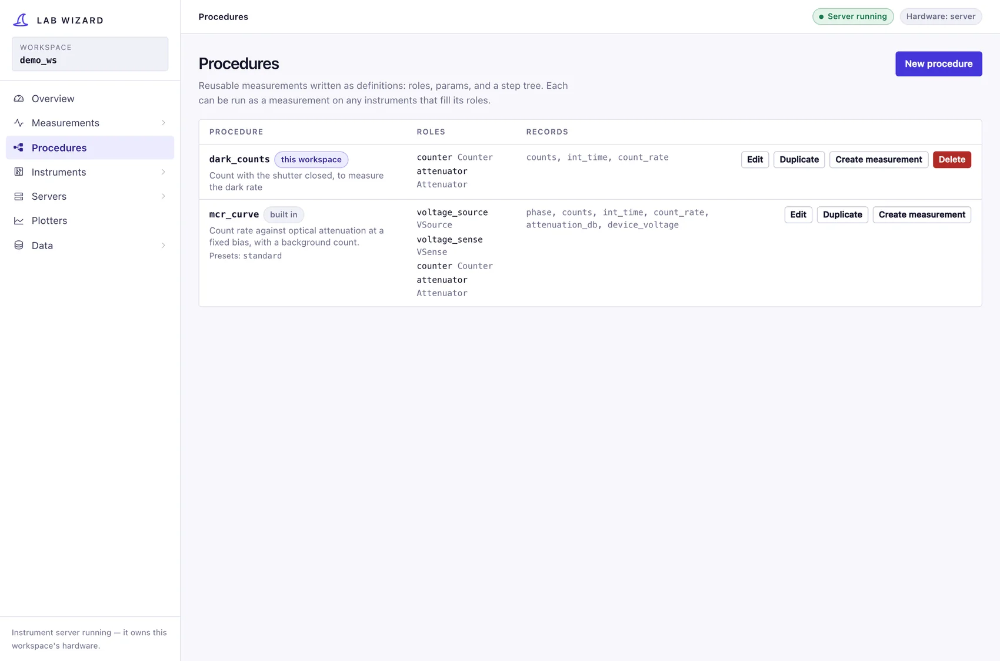
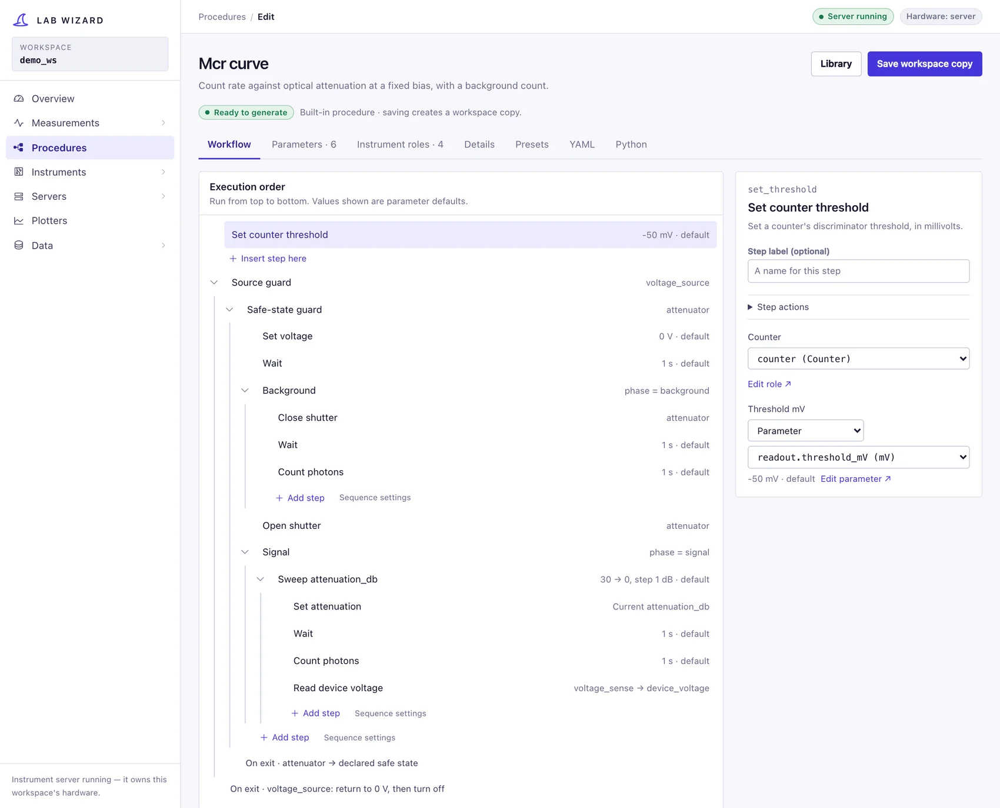
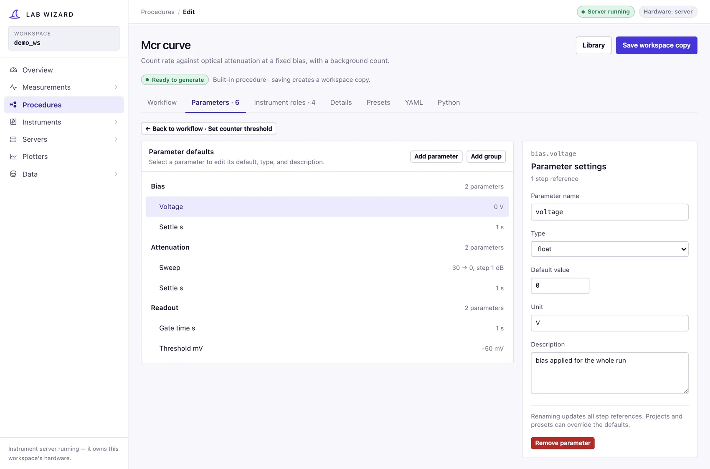
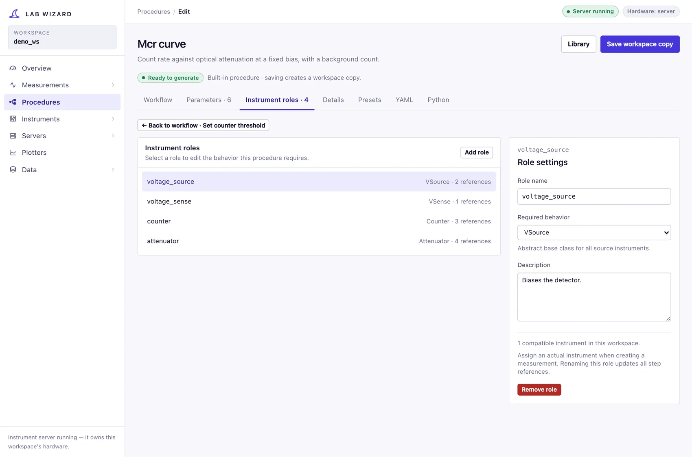
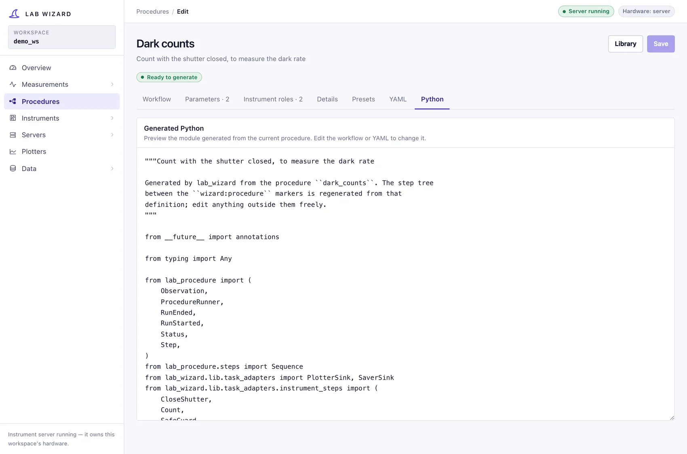
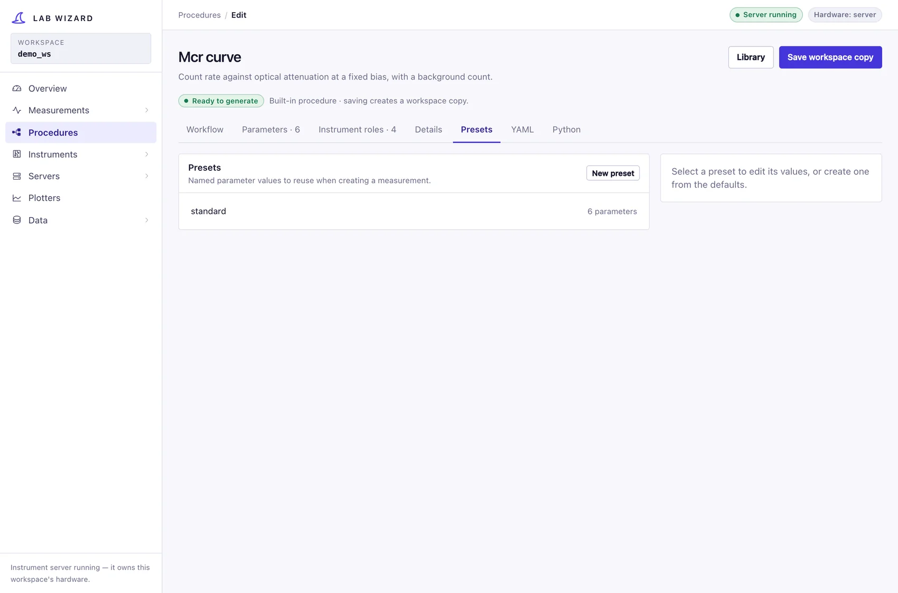

# Procedures

The **Procedures** section is where a measurement's choreography is written —
the roles it needs, the parameters it takes, and the tree of steps it runs — as
a definition rather than as Python. What a procedure *is* and how it is stored
is [Procedures](../concepts/procedures.md); this page is the section itself.

## The library

`/procedures` lists every procedure available here: the ones built into
lab_wizard and the ones saved in this workspace's `config/procedures/`. Each row
shows the roles it needs, the data columns it records, and its presets.

- **New procedure** starts from an empty sequence.
- **Duplicate** opens a copy under a new name — the usual way to adapt a
  built-in without losing the original.
- **Create measurement** goes straight to binding instruments for it.
- **Delete** removes this workspace's copy. Where that copy overrides a built-in
  the button reads **Revert**, and the built-in comes back.

Saving a built-in under its own name writes a workspace copy that takes
precedence here; the packaged one is never modified, which is why its save
button reads **Save workspace copy**.

## The editor

Eight tabs over one definition, with a pill under the title that says whether it
can be generated right now. Nothing that does not check can be saved, so a saved
procedure always generates.

### Workflow

The step tree as an execution order, read top to bottom, with each step's
current value beside it — a sweep shows its range, a parameter reference shows
the default it resolves to, a `with_parameter` shows the label it applies.
Nested steps indent under their parent and collapse independently. A guard's
exit action is shown at the end of its scope, so "the attenuator ends in its
declared safe state" is visible rather than implied.

Selecting a row opens it in the inspector on the right. **Add step** offers the
operations grouped by role: under `counter` you see what a counter can do, and
choosing one binds it to that role. A step whose behavior no role has yet is
offered under the behavior it needs, and picking it declares the role for you —
which is how most roles get created in practice. Steps that need no instrument
are grouped under structure and flow.

Each value a step takes is one of three things, chosen in the inspector:

| Mode | Means |
|---|---|
| **Fixed value** | frozen into the procedure |
| **Parameter** | read from the project's YAML, so every project can set it |
| **Current sweep value** | the value an enclosing sweep is at |

**Make parameter** turns the literal you typed into a declared parameter with
that value as its default, and points the step at it. That one button is the
whole difference between something baked into the procedure and something every
project and preset can change.

### Parameters

The parameter tree — groups and typed leaves — with an inspector for the
selected one: its name, type (`float`, `int`, `bool`, `str`, `sweep`), default,
unit, and what it means. The description becomes a comment in every project's
YAML, so it is worth writing.

The inspector counts how many steps reference the parameter, and renaming
updates all of them. A parameter with no references is a parameter nothing
reads — usually a leftover.

### Instrument roles

A role is a name and a behavior — `counter: Counter` — and together they are the
procedure's signature. A role names *a kind of instrument*, never a particular
one, which is what lets the same procedure run on any rack.

The inspector shows the behavior's own description and **how many of this
workspace's instruments could fill it**. A role nothing here can fill is legal —
a server elsewhere may have one — but it is worth seeing as you declare it,
because that is exactly the portability cost of asking for something specific.

### Plots

What a run of the procedure is looked at as. The **first plot** is what the Data
page and a live plotter draw for a run; the others are there to switch to. Each
plot names its axes by column: anything the procedure records, or a derived
column. Any column can go on any axis, so a measured voltage against another
measured voltage is a normal plot. A plot can also keep only some rows (`phase`
equals `signal`, or each run's own lowest trigger level), draw one line per run
or per value of a column, and use log axes.

**Derived columns** sit on the same tab: expressions computed from the recorded
columns whenever a run is read, never stored. Fixing an expression fixes every
past run. See [Plots and derived columns](../concepts/procedures.md#plots-and-derived-columns).

### Details, YAML, Python

- **Details** is the procedure's name and description, and where a built-in
  tells you that saving writes a workspace copy.
- **YAML** is the file as it is stored, editable if hand-editing is quicker;
  *Apply* loads it back into the composer.
- **Python** is the module a project would get. The step tree sits between
  `# wizard:procedure:start` and `# wizard:procedure:end`, and the definition
  it was generated from (recorded with every run) between
  `# wizard:definition` markers; regenerating a project replaces only those
  blocks, so edits you make around them survive.

Nothing interprets the YAML at run time — a project runs the generated Python.
The Python tab is there so that is never a mystery.

## Checking

Everything is checked after each edit, by the same rules used when saving and
when generating code — an undeclared role or parameter, a role filled by the
wrong behavior, a swept value used outside its sweep, a condition on a column no
step records, a nested sweep reusing its parent's name, a reading recorded
under a bound parameter's name, or a plot or derived column naming something
the procedure never records. Each problem is reported against the step (or plot)
it concerns, so a half-built tree tells you which step is wrong rather than
printing a paragraph.

**Warnings** are listed separately and do not block saving: they describe
something that generates and runs but is probably not intended, such as two
steps recording `counts` in the same loop body, which puts each reading on its
own row.

## Presets

A preset is a named set of parameter values — "the lab's standard sweep" —
stored in `config/measurements/<procedure>/<preset>.yml`. Choosing one while
[creating a measurement](measurements.md) copies its values into the new
project; editing the preset afterwards changes no existing project.

Presets are validated against the procedure's **saved** parameters, so the
Presets tab waits for unsaved parameter changes to be saved.

## Where a procedure goes next

A saved procedure appears in [Create measurement](measurements.md) with the
built-in ones, with its roles to bind and its presets to choose from. From there it is an ordinary project: generated Python, an editable YAML,
and a run.
