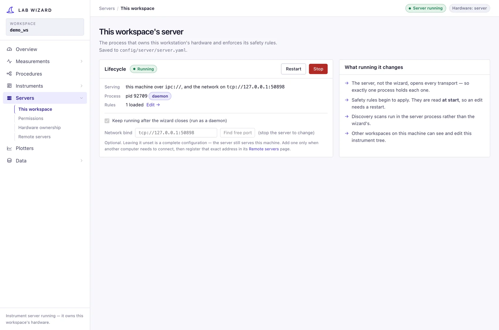
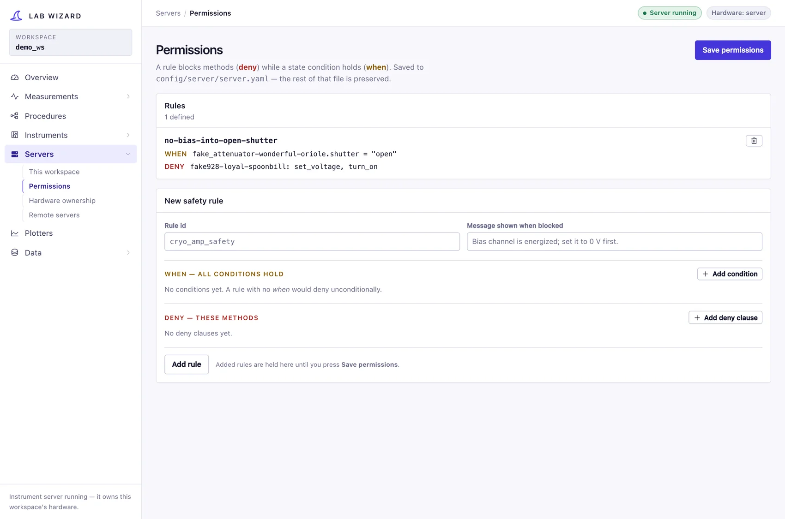
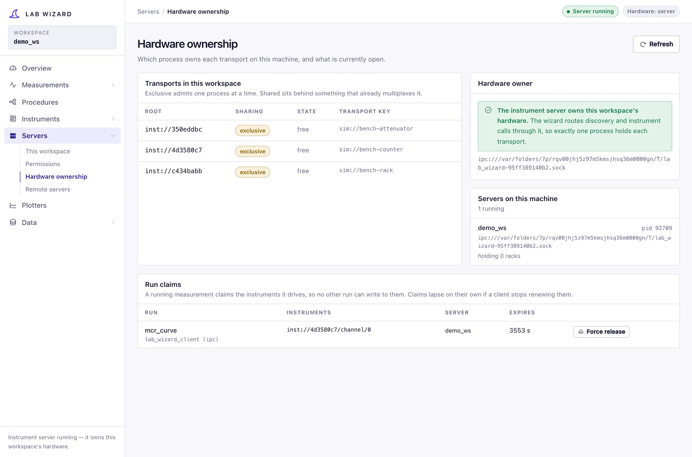

# Servers

The **Servers** section covers the two sides of sharing hardware: running a
server so other workspaces can use the instruments this machine owns, and
registering servers elsewhere so this workspace can use theirs.

The design behind it is [Remote control](../remote/architecture.md); this page
is the four sub-pages and what each is for.

## This workspace

Start, stop and address the server that hosts **this** workspace's
`config/instruments` tree.

- A server with no `bind` address serves only this machine, over an `ipc://`
  socket derived from the config directory — no port, no address to type, and
  nothing exposed off the machine. That is the right setting for a workstation
  whose own projects route through it.
- Setting a `bind` accepts clients from other machines. Those clients may read
  the tree and call instruments, never reconfigure them.

While the server runs it owns the hardware: a project that opens the same rack
locally would contend with it, which is what the conflict warning during
[measurement creation](measurements.md) is about.

See [Running & consuming servers](../remote/operations.md) for the config file
and the operational detail.

## Permissions

Safety rules, authored here and enforced by the server on every call — "deny
setting a bias while the shutter is open". Rules are evaluated against recorded
instrument state, so they hold whichever client made the call.

Rules load at server start; changing them requires a restart, which this page
does for you. The full model is [Permissions & safety](../remote/permissions.md).

## Hardware ownership

Who is using what, right now.

- **Transports** — which racks this machine's servers have open, so a rack
  showing as in use explains a refused local run.
- **Run claims** — every claim held on the machine's servers, with the holder's
  name and when it expires. A claim is a running measurement's exclusive hold on
  part of the tree; writes to a claimed instrument from any other run are
  refused, while reads stay open so you can watch a run in progress.
- **Force release** ends a claim whose run is stuck or whose client vanished.
  The released instruments are reset to their configured baseline before anyone
  else can claim them. Only accepted from this machine.

The same claims appear as **in use** markers while picking instruments, so a
busy rack is visible before you bind it rather than at 2am.

## Remote servers

The address book: a name and a URL for each server elsewhere whose instruments
this workspace may use. A generated project records the *name*, and resolves it
through this book when it runs, so a project stays readable and portable rather
than carrying a socket path.

Servers running on this machine are found automatically and do not need an
entry.
